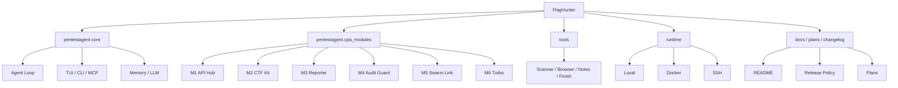

# FlagHunter

[](https://github.com/leilehuimieba/FlagHunter/releases/tag/v0.1.0)
[](https://github.com/leilehuimieba/FlagHunter/releases/tag/v0.1.0)
[](https://www.python.org/)
[](#license)
[](#典型工作模式)
[](#典型工作模式)

> **面向 CTF 与合规渗透测试的 AI 代理框架**  
> 自研的攻防自动化框架，强化 **多 API 调度、CTF 专项能力、多 Agent 协作与可观测性**

FlagHunter 的目标不是做“只能聊天的安全助手”，而是把 **计划、工具执行、策略切换、结果验证、记忆沉淀** 收敛成一个可复用、可审计、可扩展的攻防自动化框架。

> 当前 GitHub 仓库保持 **Private / Internal Collaboration**，用于受控协作与内部演进，不作为公开演示仓库使用。

---

## 快速导航

- [为什么是 FlagHunter](#为什么是-flaghunter)
- [核心能力](#核心能力)
- [架构总览](#架构总览)
- [适合谁 / 不适合谁](#适合谁--不适合谁)
- [快速开始](#快速开始)
- [典型工作模式](#典型工作模式)
- [项目状态与路线图](#项目状态与路线图)
- [文档入口](#文档入口)
- [版本发布](#版本发布)
- [Changelog](./CHANGELOG.md)
- [文档总入口](./docs/README.md)
- [Release Policy](./docs/release-policy.md)
- [Release Checklist](./docs/release-checklist.md)
- [Label Strategy](./docs/label-strategy.md)
- [Release Playbook](./docs/release-playbook.md)

---

## 为什么是 FlagHunter

FlagHunter 是一个自研的 AI 攻防自动化框架，强调 **真实实战效率** 而不是“模型自由发挥”。

它当前聚焦三个方向：

1. **更稳的模型执行面**  
   通过多 provider 路由、故障切换、成本追踪，让 Agent 在复杂任务里不容易因为单点模型故障而中断。

2. **更强的 CTF / 攻防专项能力**  
   对 Web / Crypto / Reverse / Pwn / Misc 等题型做专门工作流与能力收敛，而不是把所有问题都交给 LLM 临场猜。

3. **更可运营的工程外壳**  
   包括 MCP 接入、运行时隔离、计划文档、执行记录、版本发布、私有协作边界等，方便长期维护。

---

## 核心能力

| 能力域 | 作用 | 当前状态 |
|------|------|----------|
| **Agent Runtime** | 计划生成、工具调用、结果回流、状态机驱动循环 | ✅ |
| **API Failover (M1)** | 多 API 调度、故障切换、成本追踪、provider 路由 | ✅ |
| **CTF Workflow (M2)** | Web / Crypto / Reverse / Pwn / Misc 专项能力增强 | ✅ |
| **Report & Audit (M3 / M4)** | 报告输出、作用域检查、执行留痕、风险收口 | 🟡 |
| **Multi-Agent (M5)** | Worker 池、ShadowGraph、Swarm 路由、多 Agent 协作 | 🟡 |
| **Performance (M6)** | 缓存、上下文压缩、并发与性能优化 | ⬜ |

### 核心特性拆解

#### 1. 工具执行优先，而非纯问答

FlagHunter 更偏向：

- 先制定任务路径
- 再调用工具观察真实结果
- 再根据证据调整策略
- 最后做验证与沉淀

这比“只靠对话推理”更适合真实攻防流程。

#### 2. CTF 模式强调“确定性调度 + LLM 辅助”

在 CTF 场景下，FlagHunter 通过：

- `HypothesisEngine`
- `StrategyRegistry`
- `CapabilityRegistry`
- `CTFVerifier`
- `StrategyMemory`

把假设生成、策略选择、能力降级和 flag 验证拆开处理，尽量减少幻觉式乱试。

#### 3. 支持本地、隔离与远程三类执行面

- **LocalRuntime**：本地调试 / 开发
- **DockerRuntime**：隔离执行 / 沙箱化工具链
- **SSHRuntime**：Kali VM / 远程工具环境

#### 4. 可作为 MCP Server 对外暴露

不仅能自己跑，也能作为 MCP Server 被其它客户端或宿主驱动，用于更复杂的本地 agent 体系集成。

---

## 架构总览



### 命名说明

为减少无意义的迁移成本，项目保留了早期的内部技术命名。它们只是历史包名，**不代表对任何外部上游项目的依赖或衍生关系**：

- Python 包目录 `pentestagent/`
- 运行入口命令 `pentestagent`
- 部分历史配置字段（如 `PENTESTAGENT_MODEL`）

也就是说：

- **项目名称**：FlagHunter（独立自研项目）
- **内部历史包名**：`pentestagent`（仅为代码层命名，未来可按需重命名）

---

## 适合谁 / 不适合谁

### 适合谁

- 需要把 **CTF 解题流程** 做成更稳定自动化链路的人
- 需要 **多 provider / failover** 的本地 Agent 执行环境的人
- 想把安全工具、浏览器、终端、MCP 接口放到同一个框架里的人
- 需要在 **授权范围内** 做可回放、可审计安全测试自动化的人

### 不适合谁

- 只想要一个极简单文件脚本的人
- 只需要聊天问答、不需要工具执行的人
- 想把这套东西直接用于未授权目标的人
- 不打算维护 Python / 运行时 / 文档协作流程的人

---

## 快速开始

### 环境要求

- Python **3.10+**
- Windows / Linux / macOS
- 如需浏览器自动化：Playwright 或系统 Chromium / Edge
- 如需隔离执行：Docker
- 如需远程工具链：Kali VM / SSH 环境

### 克隆项目

```bash
git clone https://github.com/leilehuimieba/FlagHunter.git
cd FlagHunter
```

### 安装依赖

```bash
python -m venv .venv
.venv\Scripts\activate      # Windows
# source .venv/bin/activate  # Linux / macOS
pip install -r requirements.txt
```

> 说明：本仓库后续所有测试与验证，优先使用虚拟环境解释器：
>
> ```powershell
> .\.venv\Scripts\python.exe
> ```
>
> 如果不想激活环境，也可以直接用它执行脚本与测试，例如：
>
> ```powershell
> .\.venv\Scripts\python.exe -m pytest
> ```

### 配置环境变量

```bash
copy .env.example .env       # Windows
# cp .env.example .env       # Linux / macOS
```

按需填写：

- `ANTHROPIC_API_KEY`
- `OPENAI_API_KEY`
- `PENTESTAGENT_MODEL`
- 与 CPA / CTF / MCP 相关开关

### 启动

```bash
pentestagent
```

### 最常用入口

```text
/api           查看 API Hub 状态
/tools         查看工具列表
/ctf list      查看 CTF Playbook
/ctf run ...   启动 CTF 工作流
/mcp list      查看 MCP 配置
```

### 推荐起步路径

如果你是第一次接手这个仓库，建议按下面顺序理解：

1. 先读本页 `README`
2. 再看 `docs/README.md`（文档总入口）
3. 然后看 `AGENTS.md`（仓库结构与开发约束）
4. 接着看 `docs/dev/FlagHunter_架构决策记录_自顶向下骨架与两关节契约_2026-06-17_V1.md`（当前骨架与不变量）
5. 如果要继续开发，再看 `docs/dev/FlagHunter_红队智能体架构_对标顶级红队工程学_2026-06-17_V2.md`（架构方向锚）

---

## 典型工作模式

### TUI 交互

```bash
pentestagent
pentestagent -t 192.168.1.10
pentestagent tui --docker
```

### CLI / Playbook

```bash
pentestagent run -t example.com --playbook thp3_web
```

### MCP Server

```bash
pentestagent mcp_server --type stdio
pentestagent mcp_server --type sse --host 0.0.0.0 --port 8080
```

---

## 项目状态与路线图

| 方向 | 状态 | 说明 |
|------|------|------|
| 基础仓库与品牌迁移 | ✅ | 已完成新仓库与主线切换 |
| README / 展示层收口 | ✅ | 已完成首轮首页化与元数据整理 |
| CTF / API 增强能力 | 🟡 | 持续补完与验证 |
| 报告 / 审计 / 多 Agent 深化 | 🟡 | 正在收敛工程边界 |
| 性能优化与稳定化 | ⬜ | 作为后续阶段推进 |

### 下一步关注点

- 继续收紧文档与版本发布纪律
- 明确关键模块的验证矩阵
- 逐步沉淀更稳定的任务模板 / release 节奏 / 协作方式

---

## 文档入口

| 文档 | 说明 |
|------|------|
| `AGENTS.md` | 仓库结构、架构模式与开发协作约束 |
| `docs/README.md` | 文档总入口与分层导航 |
| `.github/CODEOWNERS` | 私有仓库默认 owner 与关键路径 review 归属 |
| `docs/dev/FlagHunter_架构决策记录_自顶向下骨架与两关节契约_2026-06-17_V1.md` | 当前骨架、两关节契约与不变量(ADR) |
| `docs/dev/FlagHunter_红队智能体架构_对标顶级红队工程学_2026-06-17_V2.md` | 对标真实红队工程学的架构方向锚 |
| `docs/dev/FlagHunter_agent引擎工程层优化_知识库补遗_2026-06-17_V1.md` | agent 引擎工程层优化清单 |
| `CHANGELOG.md` | 版本与仓库演进记录 |
| `docs/release-policy.md` | 版本号、changelog 与 release 规则 |
| `docs/release-checklist.md` | 发版前人工检查清单 |
| `docs/label-strategy.md` | Issue / PR 标签分层与使用规则 |
| `docs/release-playbook.md` | 从检查到发版的实际操作手册 |

---

## 版本发布

- **Current Release**：`v0.1.0`
- **Changelog**：见 [`CHANGELOG.md`](./CHANGELOG.md)
- **Release Policy**：见 [`docs/release-policy.md`](./docs/release-policy.md)
- **Release Checklist**：见 [`docs/release-checklist.md`](./docs/release-checklist.md)
- **Label Strategy**：见 [`docs/label-strategy.md`](./docs/label-strategy.md)
- **Release Playbook**：见 [`docs/release-playbook.md`](./docs/release-playbook.md)
- **License**：`MIT`
- **Website**：当前未设置公开站点链接，避免把私有仓库误当公开展示页
- **.gitignore**：已配置顶层 `.gitignore`，用于屏蔽本地环境、缓存、日志与敏感文件

---

## 安全与授权说明

FlagHunter 面向：

- CTF / 靶场环境
- 获得明确授权的安全测试环境

请不要将其中的自动化能力直接用于未授权目标。

---

## License

MIT License

