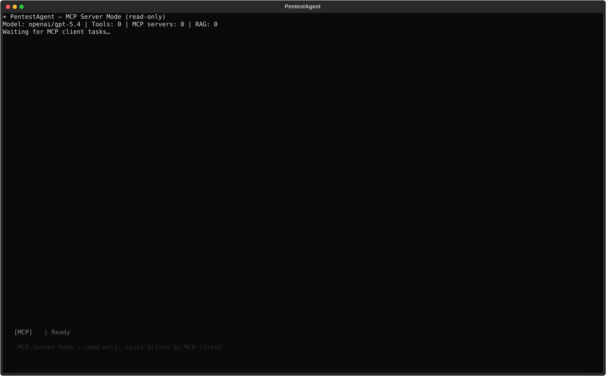
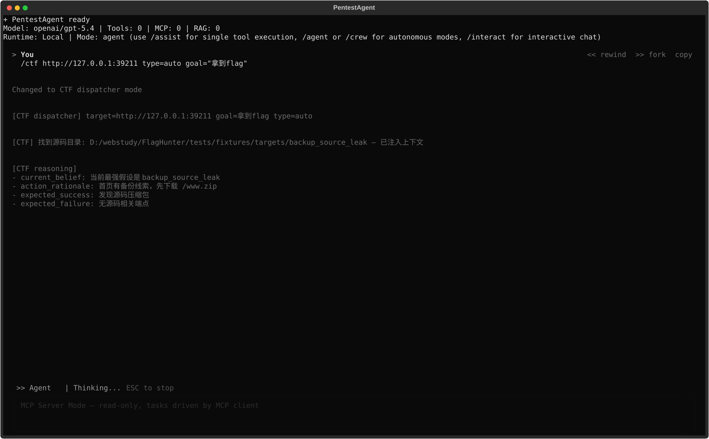
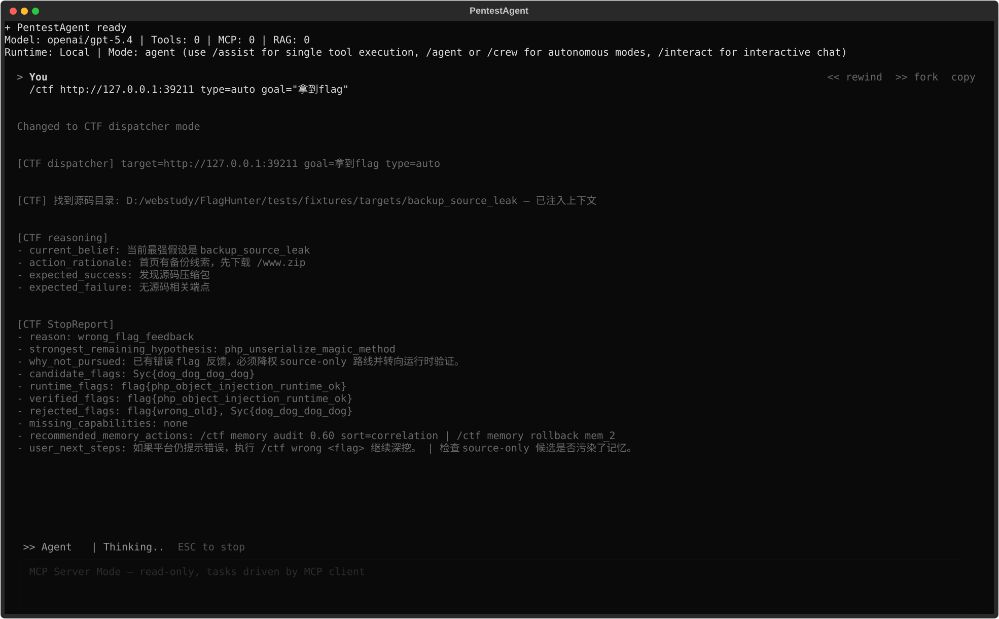

# CTF Agent 用户操作手册 V1

> **定位**：面向使用 `/ctf` 解题的操作者，而不是改内部实现的开发者。  
> **适用版本**：`D:\webstudy\FlagHunter` 当前主干，覆盖 Phase 6 已接回的 `/ctf` 交互面。  
> **相关交付物**：
>
> - 端到端 walkthrough：`D:\webstudy\FlagHunter\docs\dev\CTF_Agent_Walkthrough_PHP_Object_Injection_Acceptance_V1.md`
> - Phase 6 最终 audit：`D:\webstudy\FlagHunter\docs\dev\CTF_Agent_Phase6_最终验收审计_V1.md`
> - 截图与验证日志：`D:\webstudy\FlagHunter\docs\dev\assets\phase6\`

---

## 1. 你什么时候该看这份手册

如果你要做下面任一件事，这份手册就是入口：

- 启动一道题：`/ctf <url> ...`
- 看 agent 当前最强假设和下一步实验
- 在拿到错误 flag 后让 agent 继续深挖
- 看懂 `StopReport`
- 看 `reasoning / status / queue / capabilities`
- 管理 `StrategyMemory`

如果你要改代码、改状态模型、改 verifier 或改恢复规则，请去看：

- `D:\webstudy\FlagHunter\docs\dev\CTF_Agent_主干架构规范_V1.md`
- `D:\webstudy\FlagHunter\docs\dev\CTF_Agent_状态模型与接口契约_V1.md`
- `D:\webstudy\FlagHunter\docs\dev\CTF_Agent_分阶段开发计划_V1.md`

---

## 2. 最短上手路径

### 2.1 启动 TUI

```powershell
cd D:\webstudy\FlagHunter
pentestagent tui
```

可选运行时：

```powershell
pentestagent tui --docker
pentestagent tui --ssh
pentestagent tui --target http://127.0.0.1:3000
pentestagent tui --model <your-model>
```

### 2.2 开始第一道题

最简形式：

```text
/ctf http://localhost:3000
```

带类型提示：

```text
/ctf http://localhost:3000 type=sqli
```

带额外目标、源码路径、平台提交信息：

```text
/ctf http://localhost:3000 type=auto goal="拿到flag" src=D:/ctf/easy_login
/ctf https://ctf.example.com/challenges/42 type=web submit=auto platform=ctfd challenge_id=42 submit_url=https://ctf.example.com
```

### 2.3 首题建议操作节奏

1. 先直接跑一轮 `/ctf <url>`
2. 等 `StopReport` 或拿到 runtime / verified flag
3. 如果平台判错，立刻执行 `/ctf wrong <flag>`
4. 如果路线对但验证卡住，执行 `/ctf override <flag>`
5. 看 `/ctf reasoning`、`/ctf capabilities`、`/ctf memory audit`

---

## 3. `/ctf` 主命令：真实可用参数

当前实际入口以 `D:\webstudy\FlagHunter\pentestagent\interface\tui.py` 的解析逻辑为准：

```text
/ctf <url>
     [type=auto|web|sqli|xss|lfi|cmdi|ssrf|upload|crypto|pwn|misc]
     [goal="拿到flag"]
     [hint="..."]
     [src=<dir>]
     [submit=auto]
     [platform=ctfd]
     [challenge_id=123]
     [submit_url=https://ctf.example.com]
     [submit_endpoint=https://ctf.example.com/api/v1/challenges/attempt]
     [queue=single|switch|drain]
     [max_challenges=4]
     [timebox=900]
     [max_stops=2]
```

### 3.1 参数含义

| 参数 | 作用 | 何时用 |
|---|---|---|
| `type=` | 给判型一个明确起点 | 你已经知道是 `sqli/xss/lfi/...` |
| `goal=` | 当前目标文本 | 默认就是“拿到flag” |
| `hint=` | 初始线索 | 比如“注意备份包”“试试 PHP 反序列化” |
| `src=` | 指定源码目录 | 本地题 / docker 题尤其有用 |
| `submit=auto` | 允许自动提交 | 有平台提交能力时使用 |
| `platform=` | 平台类型 | 如 `ctfd` |
| `challenge_id=` | 平台题目 ID | 自动提交 / 自动切题时需要 |
| `submit_url=` | 平台 base URL | 自动对齐挑战、提交 flag |
| `submit_endpoint=` | 显式提交端点 | 平台适配不完整时可手填 |
| `queue=` | 多题运行模式 | `single`=单题，`switch`=可切题，`drain`=尽量把队列跑空 |
| `max_challenges=` | 最多切题数量 | 平台自治运行时控制范围 |
| `timebox=` | 总时间盒（秒） | 防止单次跑太久 |
| `max_stops=` | 连续停止次数阈值 | 平台自治时的收敛阈值 |

### 3.2 一个真实推荐例子

```text
/ctf http://127.0.0.1:3000 type=auto goal="拿到flag" hint="先看首页和备份线索"
```

---

## 4. 运行时你会看到什么

### 4.1 TUI 启动画面

截图交付物：

- `D:\webstudy\FlagHunter\docs\dev\assets\phase6\phase6_tui_startup.svg`
- `D:\webstudy\FlagHunter\docs\dev\assets\phase6\phase6_tui_running.svg`
- `D:\webstudy\FlagHunter\docs\dev\assets\phase6\phase6_tui_stopreport.svg`

可视化预览：







### 4.2 运行中的核心信息

在一轮真实解题里，最值得盯住的是：

- `current_belief`：当前最强假设
- `action_rationale`：为什么做这一步
- `expected_success`：成功长什么样
- `expected_failure`：失败长什么样
- `candidate/runtime/verified/rejected` flag 桶
- `latest_surprise`：出现与预期不一致的新信号
- `latest_retrospective`：失败路径复盘结论

### 4.3 StopReport 的标准字段

当前 TUI 最终渲染的 StopReport 结构是：

```text
[CTF StopReport]
- reason: <stop_reason>
- strongest_remaining_hypothesis: <kind or n/a>
- why_not_pursued: <why or n/a>
- candidate_flags: <comma-separated or none>
- runtime_flags: <comma-separated or none>
- verified_flags: <comma-separated or none>
- rejected_flags: <comma-separated or none>
- missing_capabilities: <comma-separated or none>
- recommended_memory_actions: <action1 | action2 | ...>
- user_next_steps: <step1 | step2 | ...>
```

重点不是“有没有 flag”，而是 **flag 在哪个桶里**：

- `candidate`：只是看到了形似 flag 的字符串，不能当真
- `runtime`：来自运行时回显，但未必已独立验证
- `verified`：已通过平台、用户 override 或独立验证口径
- `rejected`：平台/用户明确判错，后续必须降权

---

## 5. 手动干预：什么时候按哪个命令

### 5.1 `/ctf wrong <flag>`

用途：平台提示“flag 错了”后，给 agent 一个**强反证**。

```text
/ctf wrong flag{wrong_value}
```

效果：

- 该 flag 进入 `rejected_flags`
- `StopReport.reason` 变成 `wrong_flag_feedback`
- 写入 `strategy_memory_wrong_flag_audit`
- 下一步建议会自动包含：
  - `/ctf memory audit 0.60 sort=correlation`
  - `/ctf memory rollback <id>`（若有自动 mute 条目）

### 5.2 `/ctf hint <text>`

用途：你已经知道方向，但不想自己手打利用链。

```text
/ctf hint "试试 PHP 反序列化"
```

实际行为：

- 写 notes
- 回写 `_last_ctf_context`
- 空闲时以“上一轮 URL + 旧 hint + 新 hint”重新跑 dispatcher

### 5.3 `/ctf override <flag>`

用途：当前 flag 已经足够可信，但自动验证链路没法再推进。

```text
/ctf override flag{value}
```

实际行为：

- 从 `candidate/runtime` 中移出该 flag
- 提升到 `verified_flags`
- 记录 `user_flag_override`
- 重建 `StopReport.reason = flag_verified`

### 5.4 什么情况下先 wrong，什么情况下先 override

| 场景 | 正确动作 |
|---|---|
| 平台已经告诉你“错误” | 先 `/ctf wrong` |
| 运行时页面/命令回显里已经拿到可信 flag，但自动提交不可用 | `/ctf override` |
| 只是源码、zip、注释里看到了字符串 | 不要 override，先继续深挖 |

---

## 6. 推理层怎么看：`/ctf reasoning`

### 6.1 基本用法

```text
/ctf reasoning
/ctf reasoning -n 20
/ctf reasoning surprises
/ctf reasoning postmortem
```

### 6.2 `summary` 视图的实际格式

当前实现输出大致如下：

```text
[CTF reasoning]
[pre_action_reasoning 1/2]
- current_belief: 当前最强假设是 auth_form_sqli
- action_rationale: 优先执行链路 sqli ...
- expected_success: 看到登录成功提示
- expected_failure: 看到错误提示
- surprises: 2
- latest_surprise: 回显结构与预期 SQLi 行为不一致
[CTF stop_report]
- reason: runtime_pending_verification
- strongest_remaining_hypothesis: auth_form_sqli
- recommended_memory_actions: ...
- user_next_steps: ...
[CTF flags]
- candidate: flag{candidate_only}
- runtime: flag{runtime_pending}
- rejected: flag{rejected_old}
[CTF platform]
- platform_type: ctfd
- challenge_id: 42
- auto_submit: True
- platform_alignment: matched=True solved=False challenge=EasySQL
- latest_retrospective: runtime flag but no verification
```

### 6.3 `surprises` 视图

```text
[CTF reasoning surprises]
- surprise_1: 发现未知回显 portal signature
- surprise_2: 回显结构与预期 SQLi 行为不一致
```

用途：判断 agent 是否碰到了“非预期结构”，从而应该换路线而不是蛮试。

### 6.4 `postmortem` 视图

```text
[CTF reasoning postmortem]
- retro_1: runtime flag but no verification
- retro_2: source-only flag was treated as terminal too early
```

用途：看 agent 是因为 **没思路**、**验证没闭环**、还是 **记忆被误导**。

---

## 7. 能力层、状态与平台观察

### 7.1 `/ctf capabilities`

```text
/ctf capabilities
/ctf capabilities --refresh
```

输出格式：

```text
[CTF capabilities]
- sql_injection_test: implementation=manual_payload_via_requests quality=medium
- source_download: implementation=http_request quality=high
```

如果你看到 `quality=medium/low`，这表示系统在降质跑，不等于不可用。

### 7.2 `/ctf status`

```text
/ctf status
```

会汇总：

- `platform_profile_snapshot`
- `platform_sync_snapshot`
- `platform_challenge_alignment`
- `submit_gate_decision`
- `platform_task_queue_snapshot`
- `platform_autonomy_run_summary`
- `latest submit`
- `stop_reason`

适合排查“为什么它没提交”“为什么它自动切题了”。

### 7.3 `/ctf queue`

```text
/ctf queue
```

会显示：

- 队列总量 / 已解 / 未解
- 当前准备切去的下一题
- 前 8 个候选任务的优先级

---

## 8. StrategyMemory 操作面：命令与面板

### 8.1 纯命令行入口

```text
/ctf memory
/ctf memory list [limit] [active|muted|deprecated|filter=<...>] [sort=recent|correlation|applied|last_used]
/ctf memory show <id>
/ctf memory mute <id>
/ctf memory activate <id>
/ctf memory rollback <id>
/ctf memory audit [threshold] [sort=correlation|recent|applied|last_used]
/ctf memory delete <id>
/ctf memory export <path>
/ctf memory clear confirm
/ctf memory panel [filter=all|active|muted|deprecated|audit] [sort=recent|correlation|applied|last_used] [threshold=0.3]
```

### 8.2 最常用的三条

#### 审计低质量记忆

```text
/ctf memory audit 0.60 sort=correlation
```

#### 暂时禁用一条误导记忆

```text
/ctf memory mute mem_123
```

#### 把被误 mute 的条目回滚

```text
/ctf memory rollback mem_123
```

### 8.3 面板模式

```text
/ctf memory panel filter=muted sort=correlation threshold=0.6
```

当前交互面板支持：

- `Refresh`
- `All / Active / Muted / Audit`
- `Sort:Recent / Sort:Corr / Sort:Applied`
- `Mute / Activate / Rollback / Delete / Export / Clear All`

---

## 9. `/ctf` 子命令总表

下面是当前代码里真实注册并可走到的 `/ctf` 子命令：

| 命令 | 作用 | 备注 |
|---|---|---|
| `/ctf <url> ...` | 启动解题 | 主入口 |
| `/ctf list` | 列出 playbook | CPA M2 能力 |
| `/ctf run <playbook> <target>` | 跑指定 playbook | 更偏工具链 |
| `/ctf phase` | 看阶段状态 | 兼容历史 M2 命令 |
| `/ctf next` | 推进下一阶段 | 兼容历史 M2 命令 |
| `/ctf flag <flag>` | 手动提交 flag | 平台场景用 |
| `/ctf hint <text>` | 注入人工提示并继续 | 已接回 |
| `/ctf override <flag>` | 强制升级为 verified | 已接回 |
| `/ctf wrong <flag>` | 标记错误 flag 并触发深挖 | 已接回 |
| `/ctf reasoning` | 看推理摘要 | 支持 `-n / surprises / postmortem` |
| `/ctf capabilities` | 看能力快照 | 支持 `--refresh` |
| `/ctf memory` | 看记忆摘要 | 支持 list/show/mute/.../panel |
| `/ctf queue` | 看平台任务队列 | 平台自治场景 |
| `/ctf status` | 看平台/提交/停止总览 | 调试非常有用 |
| `/ctf pwn <host> <port>` | 快速 pwn 连接 | CPA M2 能力 |
| `/ctf decode <text>` | 快速解码 | CPA M2 能力 |
| `/ctf rev <binary>` | 快速逆向入口 | CPA M2 能力 |

> 注意：文档里旧版本提到过 `/ctf pause` / `/ctf resume`，**当前代码没有这两个子命令**。现在可用的停止方式是 `Esc`。

---

## 10. 常见错误与排查清单

### 10.1 `No model configured`

表现：

- 启动时提示没有模型

排查：

1. 确认 `.env` 里有 `PENTESTAGENT_MODEL`
2. 或启动时显式传 `--model`

### 10.2 `Runtime not ready`

表现：

- 执行 `/ctf` 后直接提示 runtime 未就绪

排查：

1. 确认是从 `pentestagent tui` 启动，而不是只创建了一个空 TUI 壳
2. 如果是 `--docker` / `--ssh`，检查运行时是否真的起来了

### 10.3 `Playwright not installed`

表现：

- 浏览器能力缺失

处理：

1. 先看 `/ctf capabilities`
2. 如果有降质实现，优先让系统继续跑
3. 只有完全缺能力时，再考虑安装
4. 自动安装默认关闭，需显式设置 `PENTESTAGENT_AUTO_INSTALL=true`

### 10.4 一直停在 `runtime_pending_verification`

表现：

- 已看到运行时 flag，但还没结束

处理：

1. 如果你确认这个 flag 可信：`/ctf override <flag>`
2. 如果平台说错：`/ctf wrong <flag>`
3. 看 `/ctf status` 确认是否缺提交端点 / challenge_id / auto_submit

### 10.5 总是被旧记忆带偏

处理：

```text
/ctf memory audit 0.60 sort=correlation
/ctf memory mute <id>
/ctf wrong <wrong_flag>
```

### 10.6 `source-only` 候选误导你

表现：

- 在 zip / 注释 / README 里看到 flag 样字符串

处理：

1. 不要直接当 verified
2. 看 `/ctf reasoning postmortem`
3. 优先找运行时回显、提交验证或独立验证证据

---

## 11. 配置项清单

下面只列 **当前 CTF 交互面真正会用到** 的配置。

### 11.1 `.env` 必需项

| 变量 | 作用 |
|---|---|
| `PENTESTAGENT_MODEL` | 默认模型名，未配置时 TUI 无法正常初始化 agent |

### 11.2 `.env` 常用可选项

| 变量 | 作用 |
|---|---|
| `OPENAI_API_KEY` | 使用 OpenAI / 中转 OpenAI 时需要 |
| `ANTHROPIC_API_KEY` | 使用 Anthropic / 中转 Claude 时需要 |
| `TAVILY_API_KEY` | `web_search` 工具可用性 |
| `BRAVE_SEARCH_API_KEY` | 搜索兜底 |
| `PENTESTAGENT_AUTO_INSTALL` | 工具缺失时是否自动安装，默认 `false` |
| `PENTESTAGENT_AGENT_MAX_ITERATIONS` | agent 总迭代上限 |
| `PENTESTAGENT_CTF_HINT_SEARCH_THRESHOLD` | 失败多少轮后触发提示搜索 |
| `PENTESTAGENT_CTF_WP_SEARCH_THRESHOLD` | 失败多少轮后触发 WP 搜索 |
| `CTF_FLAG_PATTERNS` | 追加自定义 flag 正则 |

### 11.3 平台 / 自动提交相关

| 变量 | 作用 |
|---|---|
| `CPA_CTF_PLATFORM_TYPE` | 平台类型，如 `ctfd` |
| `CPA_CTF_PLATFORM_URL` | 平台 URL |
| `CPA_CTF_API_KEY` | 平台 API Key |
| `CPA_CTF_AUTH_TOKEN` | 平台认证 token |
| `CPA_CTF_AUTO_SUBMIT` | 是否自动提交 |
| `CPA_CTF_CHALLENGE_ID` | 默认 challenge id |

### 11.4 CTF 模块开关

当前代码实际读取的是：

| 变量 | 说明 |
|---|---|
| `CPA_M2_CTF_KIT` | M2 CTF Kit 总开关 |
| `CPA_M2_PWN_TOOLS` | pwn 工具链 |
| `CPA_M2_CRYPTO_TOOLS` | crypto 工具链 |
| `CPA_M2_REVERSE_TOOLS` | reverse 工具链 |
| `CPA_M2_FLAG_SUBMITTER` | flag 提交能力 |

### 11.5 Provider / 韧性相关

如果你会用 `/providers` 和 M1 failover：

| 变量 | 说明 |
|---|---|
| `CPA_M1_API_HUB` / `CPA_M1_ENABLED` | M1 API Hub 开关（兼容主/旧变量） |
| `CPA_PROVIDER_<N>_*` | provider 列表配置 |
| `CPA_M1_FALLBACK_<N>_*` | failover 链 |

### 11.6 SSH / Kali 运行时

| 变量 | 说明 |
|---|---|
| `KALI_SSH_HOST` | SSH 主机 |
| `KALI_SSH_PORT` | SSH 端口 |
| `KALI_SSH_USER` | SSH 用户 |
| `KALI_SSH_KEY_PATH` | SSH 私钥 |

---

## 12. 命令行入口清单

除了 TUI 内的 `/ctf`，你还会用到这些启动命令：

```powershell
pentestagent tui
pentestagent tui --docker
pentestagent tui --ssh
pentestagent tui --target http://127.0.0.1:3000
pentestagent tui --model <model>
pentestagent run -t http://127.0.0.1:3000 --task "..."
pentestagent mcp_server --type stdio
pentestagent mcp_server --type sse --port 8080
```

---

## 13. 一道完整题怎么复现

请直接看：

- `D:\webstudy\FlagHunter\docs\dev\CTF_Agent_Walkthrough_PHP_Object_Injection_Acceptance_V1.md`

这个 walkthrough 对应的验证证据已经落地在：

- `D:\webstudy\FlagHunter\docs\dev\assets\phase6\phase6_first_attempt_validation.log`

其中记录了：

- 首次跑到 runtime/flag 的耗时
- 收口为 verified 的总耗时
- 是否实际访问了 `/www.zip`
- 是否实际触发了 `/?select=...` 运行时利用

---

## 14. Phase 6 待填充项核销

- [x] TUI 截图（启动、运行中、StopReport）
- [x] 完整的 `/ctf` 子命令列表（带示例）
- [x] 推理记录可视化的具体格式
- [x] 一道完整题的端到端 walkthrough
- [x] 常见错误信息的排查清单
- [x] 配置项（`.env` 和命令行）完整列表

