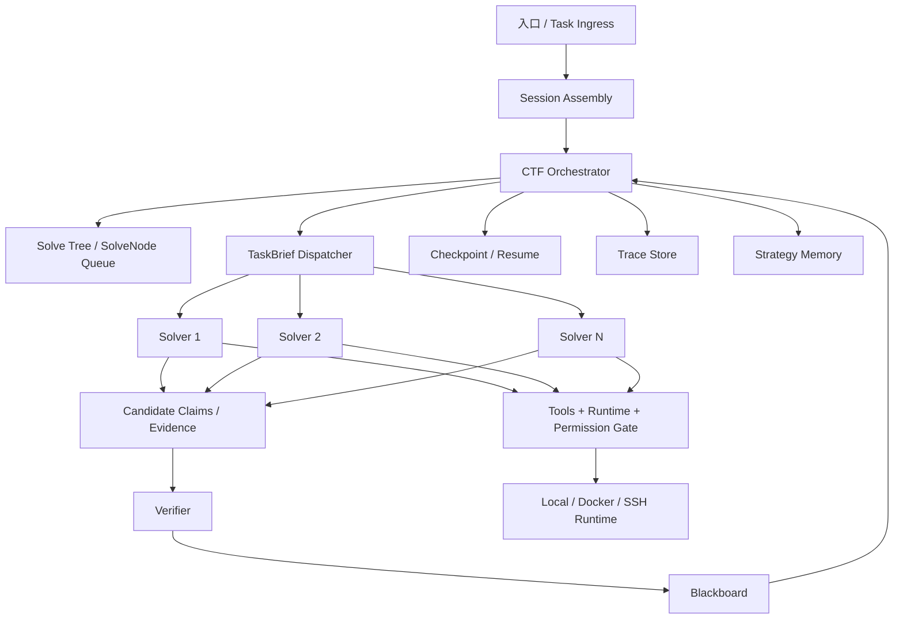

# FlagHunter CTF Solver Spec v0.1

- 日期：2026-07-02
- 状态：Draft / 作为后续改造的正式对照稿
- 适用范围：`FlagHunter` 的 **CTF 单体解题主线**、`crew` 多 Solver 解题主线、以及后续统一到 MCP / Web / TUI / CLI 的 CTF 执行面
- 非目标：本 spec **不**定义通用渗透测试 playbook 的完整行为，只约束 `CTF solver` 相关架构与控制面

---

## 0. 本文地位

本文不是现状描述，也不是灵感笔记。

本文的目标是把 FlagHunter 后续的 CTF agent 改造，收敛成一套可执行、可验收、可追责的正式规格。后续任何与 CTF 解题主干有关的改造，都应回答两个问题：

1. 是否符合本文的硬约束。
2. 若不符合，是本文要升级，还是实现偏离了目标架构。

判定优先级：

- 可靠性锚定在 **验证端**，不是模型一次答对。
- 模型负责 **决定试什么**，代码负责 **执行、判定、落盘、约束**。
- 未验证结论 **不得**以 verified 事实身份进入下游依赖链。
- 任何结论、任何工具调用、任何交接、任何验证都必须可溯源。
- 优先收敛控制面与数据纪律，后补知识库与花哨能力。

---

## 1. 目标定性

FlagHunter 在 CTF 场景下的目标，不是“会聊天的安全助手”，而是：

> 一个以 **证据驱动、验证收口、全程留痕、支持恢复与学习** 为核心的 CTF 求解系统。

它的最小闭环必须是：

`题目/目标输入 -> agent 通过工具感知环境 -> 形成候选结论 -> 验证层裁决 -> 写入事实面 -> 继续分解/收敛 -> 达成 verified 终止条件`

换句话说：

- 不是“模型给答案，工具辅助一下”
- 而是“工具和验证负责构造现实，模型负责在现实约束下推进求解”

---

## 2. 与现有代码的映射

本文不是从零发明第二套系统，而是对现有 FlagHunter CTF 主干的收敛升级。

| 现有组件 | 本 spec 中的角色 | 后续方向 |
|---|---|---|
| `AgentSession` | 入口装配 / 会话边界 | 保留 |
| `CTFCoordinator` | 顶层 Orchestrator 外壳 | 强化为唯一裁决者 |
| `CTFTaskDispatcher` | 当前 solve driver | 收敛为 Solver orchestration 主干 |
| `CTFState` | 当前运行态状态容器 | 升级为 Blackboard 运行时投影 |
| `CTFVerifier` | 验证层雏形 | 升级为统一 Claim 验证层 |
| `RecoveryController` | 恢复/停机/切链策略 | 纳入 Orchestrator 终止与回退纪律 |
| `SessionLedger` | 旁路事件日志 | 保留并提升为 Trace Store 主载体 |
| `CheckpointStore` | 恢复点存储 | 保留 |
| `tools/notes` | 本题发现存储 | 作为 Blackboard 的一部分投影 |
| `StrategyMemoryStore` | 跨题学习记忆 | 保留，但只作为历史参考输入 |
| `crew/orchestrator + worker_pool` | 多 Solver 并行运行形态 | 接入同一 CTF 数据纪律 |

架构方向上，本文默认：

- 单 agent CTF 路线仍然存在，并且是最小闭环。
- `crew` 是 **同一套控制面下的并行解题形态**，不是独立世界。
- 顶层运行模式仍由用户选择；但一旦进入 CTF 模式，内部控制面应尽量统一。

---

## 3. 架构全景



核心解释：

- `Orchestrator` 负责分解、调度、预算、终止、回退。
- `Solver` 负责探索、取证、产出候选结论。
- `Verifier` 是唯一能够把候选结论升级为 verified 的层。
- `Blackboard` 是唯一共享事实面。
- `Trace Store` 是旁路只增日志，不允许事后篡改。
- `Strategy Memory` 只提供历史参考，不能绕过验证直接变成事实。

---

## 4. 核心术语

### 4.1 SolveNode

SolveNode 表示一个待解决的子问题，是求解树上的节点。

在 CTF 里，典型 SolveNode 可以是：

- “确认目标是否存在登录面”
- “验证 `/include` 是否可控并可形成 LFI”
- “尝试从 runtime 证明该 flag 为真实可提交”
- “基于已知源码提示重放 POP 链”

### 4.2 Claim

Claim 是系统中的最小结论原子。任何会被下游消费的结论，都必须先落为 Claim。

CTF 中典型 Claim 例子：

- “目标存在登录表单”
- “参数 `file` 可控且进入 include”
- “凭据 `admin:admin` 在 `/login` 可用”
- “源码泄露路径 `/www.zip` 存在”
- “flag `DASCTF{...}` 已被平台接受”

### 4.3 Evidence

Evidence 是支撑 Claim 的原始证据，可以来自：

- 工具输出
- HTTP 响应
- 浏览器渲染结果
- 本地 challenge 文件
- 命令执行结果
- 平台提交回执

Evidence 必须能回到 trace。

### 4.4 Verification

Verification 是对 Claim 的裁决记录。核心不是“模型认可”，而是：

- runtime 可重放
- deterministic checker 通过
- 平台接受
- 独立审计确认

### 4.5 Blackboard

Blackboard 是 CTF 主控的共享事实面，不等于任意内部状态对象。

它至少包含：

- Solve tree
- Claims
- 活跃方向与已排除方向
- 当前最强 verified 依赖链
- 需要重验的受污染节点

### 4.6 Trace Store

Trace Store 是旁路只增事件流，目标是：

- 给任何 Claim 回溯到原始工具输入输出
- 给任何终止结论回溯到为何结束
- 给任何误判回溯到第一错误事实

---

## 5. 数据结构规格

以下 schema 是逻辑最小集合，可以扩展，但不能删减其核心语义。

### 5.1 Claim

```yaml
Claim:
  id: string
  content: string
  kind: string                  # 例如 credential_valid / endpoint_exists / flag_found
  level: enum                   # verified | conjecture | assumption | retracted
  producer: string              # orchestrator / solver / verifier / tool adapter
  produced_by_trace_id: string
  node_id: string
  depends_on: [claim_id]
  evidence_refs: [trace_id]
  verification_records:
    - method: enum              # runtime | deterministic | cross_check | audit | platform_submit | none
      verifier: string
      passed: bool
      evidence: string
      trace_id: string
  superseded_by: string?
  created_at: timestamp
  updated_at: timestamp
```

硬规则：

- `verified` Claim 必须至少有一条 `passed=true` 的 verification record。
- `conjecture` 或 `assumption` 派生出的下游 Claim，默认最高也只能是 `conjecture`。
- Claim 被推翻时，不物理删除，而是置为 `retracted`。
- `retracted` 必须触发依赖污染检查。

### 5.2 SolveNode

```yaml
SolveNode:
  id: string
  parent_id: string?
  goal: string
  status: enum                  # open | claimed | blocked | solved_verified
                                # solved_unverified | abandoned | needs_recheck
  claimed_by: string?
  strategy_hint: string?
  relevant_claims: [claim_id]
  result_claims: [claim_id]
  budget:
    tokens: int
    steps: int
    wall_time_sec: int
  spent:
    tokens: int
    steps: int
    wall_time_sec: int
  created_at: timestamp
  updated_at: timestamp
```

硬规则：

- 状态迁移必须由确定性代码执行，模型只能提出建议。
- `solved_verified` 必须对应至少一条覆盖节点目标的 verified Claim。
- `abandoned` 节点保留，供复盘与评测使用。

### 5.3 TaskBrief

```yaml
TaskBrief:
  id: string
  node_id: string
  to_solver: string
  global_context: string
  task: string
  out_of_scope: string
  known_claim_ids: [claim_id]
  direction: string
  deliverable_spec: string
  budget:
    tokens: int
    steps: int
    wall_time_sec: int
  escalation_rule: string
  created_at: timestamp
```

含义：

- `TaskBrief` 是 Orchestrator 派发给某个 Solver 的任务书。
- 它是强制落盘对象，不得只存在内存中。

### 5.4 Receipt

```yaml
Receipt:
  id: string
  brief_id: string
  status: enum                  # done | partial | failed | escalated
  claim_ids: [claim_id]
  key_evidence: string
  confidence: enum              # high | medium | low
  confidence_reason: string
  open_issues: string
  serendipity: string
  spent:
    tokens: int
    steps: int
    wall_time_sec: int
  created_at: timestamp
```

硬规则：

- Solver 返回结果时必须通过 Receipt，不得只靠自然语言消息隐式交接。
- Receipt 中的 Claim 默认不是 verified。

### 5.5 TraceEvent

```yaml
TraceEvent:
  trace_id: string
  parent_trace_id: string?
  timestamp: timestamp
  actor: string
  kind: enum                    # model_call | tool_call | handoff | verification
                                # state_transition | budget_event | checkpoint
  payload: object
```

硬规则：

- `model_call` 必须记录拼装后的最终 prompt 与完整输出。
- `tool_call` 必须记录工具名、参数、结果或错误、时长。
- `verification` 必须能指向被验证的 Claim。
- Trace Store 只增不改。

---

## 6. 组件行为规格

### 6.1 Entry / Session Assembly

- 入口层负责模式识别、参数接入、会话初始化。
- 入口层不负责解题决策。
- CTF 模式下，入口必须显式构造 CTF Orchestrator 主线。
- 顶层模式由用户选择，不由 agent 自行切换运行架构。

### 6.2 Orchestrator

Orchestrator 是 CTF 解题过程中的唯一顶层裁决者。

职责：

- 接收题目/目标/本地 challenge context
- 建立根 SolveNode
- 决定是否分解子节点
- 给 Solver 派发 TaskBrief
- 回收 Receipt
- 送验证层裁决
- 处理 Claim 污染传播
- 控制预算
- 决定终止

硬规则：

- 必须是自主循环，而不是一次性计划后照单执行。
- 必须维护 solve tree，而不是只维护平铺步骤列表。
- 同一节点、同一方向连续失败达到阈值后，必须换向、降级或停止。
- 只有 Orchestrator 可以裁决“这题结束了”。

终止条件：

- 当且仅当存在一条从 verified 子结论到最终答案的完整依赖链时，才可按“成功”终止。
- 若预算耗尽，则只能按“未完全验证的当前最优结果”终止，并明确标注未验证部分。

### 6.3 Solver

Solver 的职责是探索与取证，不是宣布真相。

Solver 循环至少包含：

1. 读取 TaskBrief
2. 组装局部上下文
3. 决定下一步动作
4. 调用工具或推导
5. 回收观察
6. 形成候选 Claim
7. 自验
8. 提交 Receipt

硬规则：

- Solver 默认只能产出 `conjecture` 或 `assumption` 级 Claim。
- Solver 必须把工具错误当作观察继续喂回，而不是异常中断整个任务。
- 提交 Receipt 前必须先做力所能及的自验。
- Solver 不得直接读取其他 Solver 的中间过程，只能读取 Blackboard 上允许共享的条目。

CTF 特化规则：

- 任何声称“漏洞已成立”“凭据已可用”“flag 为真实”的结论，都必须附 runtime 证据或可重放证据。
- 仅凭源码文本、HTML 注释、猜测性字符串命中，不得直接形成 verified 结论。

### 6.4 Verifier

Verifier 是唯一有权把 Claim 升级为 verified 的层。

建议的验证分层：

- `L1 runtime / deterministic`
  通过实际 replay、代回、checker、约束满足、提交接口响应等机械验证。
- `L2 cross_check`
  用另一条独立手段交叉验证，例如不同 payload、不同路径、不同最小化构造。
- `L3 independent audit`
  对复杂 exploit / proof chain 做独立审查，不复用 Solver 的隐式结论。
- `L4 self_consistency`
  仅作兜底或置信度参考，不得单独构成 verified 依据。

硬规则：

- 能做 L1 的地方必须优先做 L1。
- 搜索结果、历史 writeup、strategy memory 命中的内容，必须经验证后才能升级。
- 拒绝时必须返回可行动的失败信息，而不是只说失败。

### 6.5 Blackboard

Blackboard 是唯一共享事实面。

它至少应包含：

- solve tree
- 所有 Claim
- 当前 verified 主链
- 活跃方向
- 已排除方向
- 待重验节点

纪律：

1. 所有条目必须带等级。
2. 所有条目必须可追溯到 producer 和 trace。
3. 园丁/收敛器负责清理死方向、合并等价结论、维护全局摘要。

上下文注入规则：

- 注入给某个 Solver 的上下文应为 `全局摘要 + 当前节点相关局部事实`。
- 不得全板灌入。

### 6.6 Tools + Runtime + Permission Gate

工具层负责实际感知和执行，Runtime 负责承载执行面。

硬规则：

- 所有工具调用必须经过统一执行入口。
- 所有工具调用必须经过 Permission / Scope / Policy Gate。
- 结果与错误必须原样回流到 trace。
- 高风险动作必须具备更高层级的显式允许条件。

CTF 特化建议：

- Recon、VulnScan、Exploit、Post-Exploit 风险应明确分级。
- “模型看起来像成功”不构成 exploit success；只有 runtime evidence 才算。

### 6.7 Trace / Checkpoint / Resume

- 所有 handoff、model_call、tool_call、verification、state_transition、checkpoint 都必须落 trace。
- checkpoint 必须可独立恢复子任务，不要求全局重跑。
- resume 后必须保留原有 trace continuity，不得产生身份不明的重复 Claim。

### 6.8 Strategy Memory

Strategy Memory 的职责是“历史参考”，不是事实源。

允许提供：

- 相似题历史策略
- 曾经有效的 primitive sequence
- 已知失败 payload
- learned rules

硬规则：

- 历史记忆注入时必须显式标记为参考，而不是事实。
- 记忆命中后形成的新 Claim，默认仍需重新验证。
- 错 flag / 错策略的反馈必须能回写 memory 评分，抑制未来复用。

---

## 7. CTF 三种运行形态

### 7.1 单 agent / 通用模式

这条路线不是本文主目标，但若进入 CTF 语境，后续应尽量复用同样的数据纪律：

- 也要产出 Claim
- 也要经过 Verifier
- 也要落 trace

### 7.2 单 agent / CTF 模式

这是本文的最小闭环，也是优先治理对象。

要求：

- 必须有 solve tree，哪怕开始只有根节点
- 必须有 TaskBrief / Receipt 概念，哪怕 Solver 与 Orchestrator 暂时在同一进程
- 必须由 Verifier 升级事实

### 7.3 Crew / 多 Solver 模式

Crew 不是另一套独立协议，而是同一套 CTF 控制面的并行运行形态。

要求：

- 多个 Solver 不直接交换中间过程
- 共享只通过 Blackboard
- 各 Solver 的方向多样性由 Orchestrator 指定
- 所有 Solver 仍共用同一验证层和同一 Claim 纪律

---

## 8. 硬约束清单

以下是 v0.1 的 MUST 级要求。

### 8.1 事实分级纪律

- 未验证结论不得进入 verified 链。
- 只有 Verifier 有权升级 verified。
- 搜索结果、writeup、strategy memory 命中默认最多是 assumption。

### 8.2 污染传播纪律

- 任何 Claim 被 retracted 后，所有依赖它的下游 Claim 必须标记待重验。
- 受影响 SolveNode 必须从已解决态回退。

### 8.3 溯源纪律

- 任一最终答案必须可沿 `Claim -> trace -> tool/model/handoff -> upstream Claim -> ... -> 题面` 完整回溯。
- 若因果链中断，则该结论不得视为 fully trusted。

### 8.4 验证纪律

- flag 命中不等于成功。
- source-only 证据不等于 exploit success。
- runtime evidence 不等于 platform accepted，除非题型配置允许 local auto verify。

### 8.5 预算纪律

- 预算在 Orchestrator 层统一持有。
- Solver 触线后必须优雅返回 partial Receipt。
- 同向重复失败必须触发换向、降级或停止。

### 8.6 运行模式纪律

- 顶层模式由用户选择。
- 单 agent 不自动升级为 crew 架构。
- 但任何模式一旦进入 CTF 主干，都应尽量遵循相同 Claim / Verifier / Trace 纪律。

---

## 9. 分阶段改造路线

### 阶段一：统一事实与验证纪律

交付物：

- 统一 Claim 模型
- 统一 VerificationRecord 模型
- 把 `candidate/runtime/verified/rejected` 收敛进 Claim 等级体系
- 扩展 Verifier，从 flag 验证扩到关键事实验证

毕业标准：

- 除 Verifier 外，没有路径可以写 verified
- 错 flag / source-only 假阳性能被稳定拦下

### 阶段二：Blackboard 与交接物收敛

交付物：

- SolveNode 状态机
- TaskBrief / Receipt 落盘
- Blackboard 持久化协议
- 全局摘要与污染传播规则

毕业标准：

- 任一节点都能说清当前状态、依赖事实、预算消耗
- 任一 Claim 被推翻后，可自动找出受影响节点

### 阶段三：统一单体与 crew 的 CTF 控制面

交付物：

- 单 agent CTF 与 crew 共用同一 Claim / Verifier / Blackboard 协议
- direction 多样性由 Orchestrator 明确下发
- crew worker 不再共享私有中间过程

毕业标准：

- 单体与 crew 路线都能导出同型 trace / claim / verification 结构

### 阶段四：学习闭环

交付物：

- strategy memory 的读写闭环
- wrong-flag / wrong-strategy 反向反馈
- solved challenge archive
- trap library / failure pattern library

毕业标准：

- 历史经验能提高解题效率
- 历史错误能降低重复犯错率

---

## 10. 验收思路

后续所有落地改造，至少应覆盖以下 6 类验收。

### 10.1 事实分级验收

- 抽查若干结论，确认都有 level、producer、trace、verification 记录。
- 确认 source-only 证据不会被误升为 verified。

### 10.2 验证链验收

- 构造故意埋错的 exploit 结论、错误 flag、假凭据，验证系统能否拒绝。
- 确认 rejected 信息能回流到后续决策。

### 10.3 溯源验收

- 从最终答案回溯到题面和原始工具输出，要求链路无断点。

### 10.4 污染传播验收

- 手动把一条上游 Claim 置为 retracted，检查下游是否自动进入待重验。

### 10.5 预算与停机验收

- 小预算难题下，系统应输出 partial 结果而不是硬编成功。
- 简单题应快速收敛，不应无限空转。

### 10.6 路线一致性验收

- 同一道题在单 agent CTF 与 crew 模式下，导出的核心对象结构应一致：
  Claim、Verification、Trace、SolveNode、Receipt。

---

## 11. 当前不做什么

v0.1 明确不要求先完成以下事项：

- 不要求先把知识库做大
- 不要求先把所有 notes / memory / graph 完全合并成一个类
- 不要求先重写全部 UI / MCP / Web 接口
- 不要求先引入更重的算法控制器

v0.1 优先级只有一句话：

> 先把“什么是事实、谁能验证、如何回溯、如何回退、如何结束”这五件事钉死。

---

## 12. 一页纸总结

FlagHunter CTF Solver 的目标态可以压成这 7 句话：

1. 用户决定顶层运行模式，CTF 模式进入统一的 CTF 控制主干。
2. Orchestrator 负责分解、调度、预算、终止与污染回退。
3. Solver 负责探索、取证、自验与提交候选结论。
4. 所有可消费结论都必须落为 Claim，并带等级与溯源。
5. 只有 Verifier 有权把 Claim 升级为 verified。
6. Blackboard 是唯一共享事实面，Trace Store 是唯一历史真相链。
7. Strategy Memory 只提供历史参考，绝不绕过验证直接变成事实。

这就是后续 FlagHunter CTF 改造的正式北极星。
