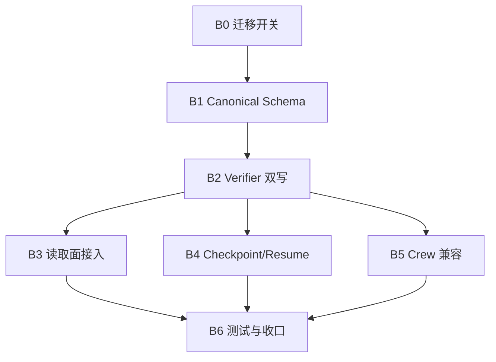

# FlagHunter P1 Claim / Verification Backlog v0.1

- 日期：2026-07-02
- 状态：Draft / 基于 `FlagHunter_Claim_VerificationRecord_Schema_Design_v0.1_2026-07-02.md` 的首批实现 backlog
- 所属路线：[FlagHunter_CTF_Solver_Implementation_Roadmap_v0.1_2026-07-02.md](./FlagHunter_CTF_Solver_Implementation_Roadmap_v0.1_2026-07-02.md)
- 施工图：[FlagHunter_Claim_VerificationRecord_Schema_Design_v0.1_2026-07-02.md](./FlagHunter_Claim_VerificationRecord_Schema_Design_v0.1_2026-07-02.md)
- 适用范围：`P1 统一 Claim / VerificationRecord`

---

## 0. 本文目的

本文把 `P1` 从“设计稿”继续下沉为“模块级首批实现 backlog”。

目标不是列一堆愿望，而是明确：

- 先做什么
- 后做什么
- 每项改哪些模块
- 每项完成的判定标准是什么
- 哪些项能单独开 PR
- 哪些项绝对不能并行乱改

后续如果要真正进入代码改造，建议以本文作为 `P1` 的默认任务板。

---

## 1. P1 收口目标

P1 的最终目标只有一句话：

> 让 FlagHunter 的 CTF 主线第一次拥有一条 canonical 的事实协议，并把 `verified` 的授予权限收口到 verifier。

换成可执行判定，就是下面 4 条：

1. 存在 canonical `Claim` 与 `VerificationRecord` 对象。
2. `flag_found` 至少已经跑通双写与读取闭环。
3. 非 verifier 路径不能直接写 `verified`。
4. 顶层终止、blackboard、checkpoint 至少能读取 canonical claim。

---

## 2. 实施范围边界

### 2.1 P1 必做

- canonical `Claim` / `VerificationRecord` 数据结构
- `CTFState` 中的 claim store
- flag 路径双写
- verifier 写权限收口
- blackboard claim 投影
- checkpoint claim 持久化
- 基础测试与不变量测试

### 2.2 P1 可选但不强制

- `credential_valid` 的最小 claim 验证入口
- `endpoint_exists` 的最小 claim 验证入口
- `exploit_succeeded` 的最小 claim 验证入口

### 2.3 P1 明确不做

- SolveNode
- TaskBrief / Receipt
- crew 全面协议统一
- trace 全量事件补齐
- strategy memory 重构

---

## 3. 模块影响面

P1 主要影响模块如下：

### 3.1 核心状态与验证

- `flaghunter/agents/pa_agent/ctf_state.py`
- `flaghunter/agents/pa_agent/verifier.py`
- `flaghunter/agents/pa_agent/coordinator.py`
- `flaghunter/agents/pa_agent/ctf_dispatcher.py`

### 3.2 读取投影与上下文消费

- `flaghunter/agents/pa_agent/blackboard.py`
- `flaghunter/agents/pa_agent/blackboard_adapter.py`
- `flaghunter/agents/pa_agent/session_context.py`
- `flaghunter/agents/pa_agent/context_assembler.py`
- `flaghunter/agents/pa_agent/progress_tracker.py`
- `flaghunter/agents/pa_agent/recovery.py`
- `flaghunter/agents/pa_agent/reasoning.py`

### 3.3 持久化与恢复

- `flaghunter/harness/checkpoint_store.py`
- `flaghunter/agents/pa_agent/audit_infra.py`

### 3.4 crew 兼容层

- `flaghunter/agents/pa_agent/ctf_crew_coordinator.py`
- `flaghunter/agents/pa_agent/ctf_crew_runner.py`
- `flaghunter/agents/crew/swarm_bridge.py`

### 3.5 测试面

- `tests/unit/agents/*`
- `tests/integration/*`

---

## 4. 推荐任务顺序

P1 不建议按“谁先看到哪个文件就改哪个文件”的方式推进。

推荐固定顺序：

1. `B0` 先锁语义边界与迁移开关
2. `B1` 再落 canonical schema
3. `B2` 再把 verifier 接上
4. `B3` 再接 blackboard / context / recovery 读取面
5. `B4` 再接 checkpoint / resume
6. `B5` 再补 crew 兼容
7. `B6` 最后补测试和旧入口收口

原因很简单：

- 没有 schema，后续每个模块都会各自发明一套 claim
- 没有 verifier 收口，claim 只是换了个名字，纪律没变
- 没有读取面接入，canonical store 只是摆设

---

## 5. 模块级 backlog

### B0. 迁移开关与语义冻结

**目标**

先把 P1 的实现边界和兼容策略钉住，避免后续一边改一边漂移。

**影响模块**

- `flaghunter/config/settings.py`
- `flaghunter/config/constants.py`
- `flaghunter/agents/pa_agent/ctf_state.py`
- `flaghunter/agents/pa_agent/verifier.py`

**建议任务**

- `P1-001` 定义 feature flag
  - 建议名：`FLAGHUNTER_CTF_CLAIMS_V1`
  - 作用：允许新旧结构双写 / 双读切换
- `P1-002` 定义 P1 期 claim kind 白名单
  - 至少包含：`flag_found`
  - 可预留：`credential_valid`、`endpoint_exists`、`exploit_succeeded`
- `P1-003` 明确 runtime 语义不再作为顶层 claim level

**完成标准**

- 有明确配置开关
- P1 受影响模块都能读到同一个开关
- 文档与代码常量一致

**风险**

- 如果没有开关，后续无法安全双写和回退

---

### B1. Canonical schema 与 claim store 落地

**目标**

在 `CTFState` 中真正落下 canonical `Claim` / `VerificationRecord` 数据结构与索引。

**影响模块**

- `flaghunter/agents/pa_agent/ctf_state.py`

**建议任务**

- `P1-101` 新增 `ClaimLevel` / `ClaimStatus` / `ClaimKind` 等类型定义
- `P1-102` 新增 `Claim` dataclass
- `P1-103` 新增 `VerificationRecord` dataclass
- `P1-104` 在 `CTFState` 中新增 canonical store
  - `claims_by_id`
  - `claim_index_by_kind`
  - `verification_records_by_id`
  - `verification_index_by_claim`
- `P1-105` 新增 claim mutation API
  - `create_claim(...)`
  - `append_verification_record(...)`
  - `upgrade_claim_to_verified(...)`
  - `retract_claim(...)`
- `P1-106` 新增 claim 查询 API
  - `get_claim(...)`
  - `find_claims_by_kind(...)`
  - `strongest_claim(...)`
  - `active_claims(...)`
- `P1-107` 新增 snapshot / restore 序列化支持

**代码约束**

- 不建议把 `FlagRecord` 直接扩写成 `Claim`
- 新结构要独立存在，旧 flags 桶只作为兼容投影

**完成标准**

- `CTFState` 已能保存和恢复 canonical claim store
- 不打开功能开关时，旧行为保持稳定
- 打开功能开关后，可以创建、查询、升级、回退 claim

**风险**

- 这里如果设计得太“泛”，后面 verifier 很难接
- 这里如果直接改旧 flags 桶语义，回归风险会很高

---

### B2. Verifier 接入与 verified 写权限收口

**目标**

让 `CTFVerifier` 成为 canonical claim 升级的唯一授权入口。

**影响模块**

- `flaghunter/agents/pa_agent/verifier.py`
- `flaghunter/agents/pa_agent/flag_observer.py`
- `flaghunter/agents/pa_agent/coordinator.py`
- `flaghunter/agents/pa_agent/ctf_dispatcher.py`

**建议任务**

- `P1-201` 保留 `verify_flag()` 外部接口，但内部补 canonical claim 写入
- `P1-202` 把 `VerificationResult` 与 `VerificationRecord` 对齐
- `P1-203` 在 `verify_flag()` 中实现双写
  - 旧路径：继续写 `candidate/runtime/verified/rejected` flags
  - 新路径：同步创建 / 更新 `Claim(kind=flag_found)`
  - 同步追加 `VerificationRecord`
- `P1-204` 封禁非 verifier 直接写 verified claim
- `P1-204a` 固化 `verifiedFlag` / `verify_or_submit_flag` 的 selector-only 语义
  - `verifiedFlag` 只能作为 selector / routing signal，不能作为 proof
  - 不能单独造成 success、`verification_decision`、legacy `verified_flags` 写入，或 canonical verified claim
- `P1-205` 顶层终止条件增加 canonical verified claim 读取
- `P1-206` 给“prior submit accepted / local auto verify / operator confirm / reject”分别定义 verification record 映射

**最小交付口径**

先只要求 `flag_found` 跑通：

- `candidate` -> `conjecture`
- `runtime` -> `conjecture + runtime_supported verification`
- `verified` -> `verified`
- `rejected` -> `retracted`

**完成标准**

- 对同一个 flag，旧 flags 桶与 canonical claim 能双写一致
- 只有 verifier 能把 `flag_found` 升到 `verified`
- `verify_or_submit_flag` 只能读取 state 中已有的 canonical verified `flag_found` claim；否则必须继续正常流程
- 已有“错 flag / source-only / prior rejected / prior accepted”路径都仍可工作

**风险**

- `VerificationResult` 与新 `VerificationRecord` 会有一段时间并存
- verifier 逻辑分支较多，最容易引入语义漂移
- CLI / Web / MCP / replay 入口仍会携带 `verifiedFlag` 字段；后续维护必须避免把该字段重新当作 proof 使用

---

### B3. 读取面改造：blackboard / context / recovery / reasoning

**目标**

让 canonical claim 不只是“被写进去”，而是能被当前主线真正读起来。

**影响模块**

- `flaghunter/agents/pa_agent/blackboard.py`
- `flaghunter/agents/pa_agent/blackboard_adapter.py`
- `flaghunter/agents/pa_agent/session_context.py`
- `flaghunter/agents/pa_agent/context_assembler.py`
- `flaghunter/agents/pa_agent/progress_tracker.py`
- `flaghunter/agents/pa_agent/recovery.py`
- `flaghunter/agents/pa_agent/reasoning.py`

**建议任务**

- `P1-301` blackboard 增加 canonical claim 投影
  - strongest verified facts
  - runtime-supported conjectures
  - retracted recent facts
- `P1-302` `record_fact()` 改为：
  - 能结构化时，创建 `assumption/conjecture` claim
  - 不能结构化时，继续保留 observation fallback
- `P1-303` `session_context` / `context_assembler` 优先从 claim store 组装摘要
- `P1-304` `progress_tracker` 增加 claim 维度计数
- `P1-305` `recovery` 优先读取 canonical `flag_found` claim 状态
- `P1-306` `reasoning` / prompt context 在不破坏旧行为的前提下接入 claim 视图

**建议策略**

- 先“读 claim，读不到再读旧 flags”
- 不要在这一批就把所有旧 summary 字段删掉

**完成标准**

- 打开开关后，blackboard 能投影 canonical `flag_found`
- context summary 至少能从 canonical claim 读出 verified/runtime/retracted 信息
- recovery 的 stop 判断至少有一条 canonical claim 分支

**风险**

- 读取面分布很散，最容易漏
- 若一次性删旧读取逻辑，现有测试会大面积破

---

### B4. Checkpoint / Resume 接入

**目标**

让 canonical claim store 进入恢复闭环，而不是每次都从 flags 反推。

**影响模块**

- `flaghunter/agents/pa_agent/ctf_state.py`
- `flaghunter/harness/checkpoint_store.py`
- `flaghunter/agents/pa_agent/audit_infra.py`
- `flaghunter/agents/pa_agent/coordinator.py`

**建议任务**

- `P1-401` checkpoint payload 增加 canonical claims
- `P1-402` checkpoint payload 增加 verification records
- `P1-403` 恢复路径优先恢复 canonical claim，再回填旧 flags 投影
- `P1-404` 对恢复后的完整性做校验
  - claim id 不丢
  - verification 引用不悬空
- `P1-405` 若 checkpoint 为旧格式，则走兼容恢复

**完成标准**

- 新 run 的 checkpoint 能带着 claim store 落盘
- resume 后 verified claim 仍然存在且可读
- 旧 checkpoint 仍可恢复

**风险**

- snapshot 兼容是 P1 高风险点之一
- 如果恢复顺序错了，旧 flags 和新 claim 会互相污染

---

### B5. crew 兼容层最小接入

**目标**

不重做 crew，只保证它不会成为 P1 的破口。

**影响模块**

- `flaghunter/agents/pa_agent/ctf_crew_coordinator.py`
- `flaghunter/agents/pa_agent/ctf_crew_runner.py`
- `flaghunter/agents/crew/swarm_bridge.py`

**建议任务**

- `P1-501` worker result 兼容 canonical claim 摘要
- `P1-502` crew coordinator 在 merge runtime/verified flag 时同步读写 claim
- `P1-503` swarm bridge 输出增加 claim-aware summary
- `P1-504` crew stop reason 对 canonical verified claim 保持一致

**完成标准**

- crew 模式下至少 `flag_found` 的 verified / rejected 语义不丢
- worker 合并结果不会绕过 verifier 直接写 verified

**风险**

- crew 逻辑天然比单体更分散
- 这里不宜追求“彻底统一”，只做 P1 兼容兜底

---

### B6. 测试、收口与旧入口限制

**目标**

让 P1 不是“代码看起来差不多”，而是“可以确认已收口”。

**影响模块**

- `tests/unit/agents/test_ctf_dispatcher.py`
- `tests/unit/agents/test_ctf_coordinator.py`
- `tests/unit/agents/test_ctf_recovery.py`
- `tests/unit/agents/test_blackboard_loop_bypass.py`
- `tests/integration/test_ctf_dispatcher_acceptance.py`
- `tests/integration/test_ctf_dispatcher_llm_fallback_acceptance.py`
- `tests/integration/test_local_challenge_runner.py`

**建议任务**

- `P1-601` 为 claim store 新增单元测试
- `P1-602` 为 verifier 双写新增单元测试
- `P1-603` 为 checkpoint restore 新增单元测试
- `P1-604` 为 blackboard claim 投影新增单元测试
- `P1-605` 为 canonical verified stop 新增集成测试
- `P1-606` 为 wrong flag / rejected path 新增集成测试
- `P1-607` 搜索并限制新的“直接写 verified”入口

**完成标准**

- 至少覆盖 I-C1 ~ I-C6 中最关键的不变量
- 单体主线的 flag 验证不回退
- 打开功能开关时，主测试集可通过

**风险**

- 如果不先补测试，后面 P2 / P3 会踩着 P1 的结构债继续漂

---

## 6. 推荐 PR 切分

P1 不建议一个超大 PR 一口气做完。建议按下面 6 片切：

1. `PR-A`
   - `B0` + `B1`
   - 只落 schema、store、序列化、feature flag
2. `PR-B`
   - `B2`
   - 只做 verifier 双写与写权限收口
3. `PR-C`
   - `B3`
   - 只做 blackboard / context / recovery 的 claim 读取
4. `PR-D`
   - `B4`
   - 只做 checkpoint / resume
5. `PR-E`
   - `B5`
   - 只做 crew 兼容兜底
6. `PR-F`
   - `B6`
   - 测试、收口、删除明显危险的旧入口

这样切的好处：

- 回滚边界清楚
- 评审负担可控
- 每片都能单独验收

---

## 7. 依赖关系图

说明：

- `B1` 之前不要动 verifier 语义
- `B2` 之前不要删旧 flags 读取
- `B6` 之前不要声称 P1 已经完成

---

## 8. 高风险点提醒

### 8.1 `ctf_state.py` 是 P1 中心枢纽

这里最容易出现的问题是：

- schema 漂
- snapshot 不兼容
- 双写 API 设计不稳定

### 8.2 `verifier.py` 是最敏感路径

这里最容易出现的问题是：

- verified 语义被破坏
- prior submit / local auto verify 分支漏映射
- rejected path 与 canonical `retracted` 不一致

### 8.3 读取面分散

至少下面这些读取点不能忘：

- `blackboard.py`
- `session_context.py`
- `context_assembler.py`
- `progress_tracker.py`
- `recovery.py`
- `reasoning.py`

### 8.4 crew 不宜过度设计

P1 里 crew 只做兼容，不做彻底重构，否则会拖慢单体主线收口。

---

## 9. P1 毕业检查单

只有当下面问题都能答“是”，P1 才算毕业：

1. 是否已经存在 canonical `Claim` / `VerificationRecord`？
2. `flag_found` 是否已经完成双写闭环？
3. 非 verifier 路径是否已经不能直接产出 `verified`？
4. blackboard / context / recovery 是否至少部分读取 canonical claim？
5. checkpoint / resume 是否已经保留 canonical claim？
6. crew 是否至少不会绕过 verifier 破坏 claim discipline？
7. 测试是否已覆盖核心不变量与错误路径？

只要有一项答“否”，P1 都还没真正完成。

---

## 10. 建议执行方式

如果由我们自己继续推进，我建议按下面节奏做：

1. 先做 `PR-A`
   - 用最小代价把 schema 和 store 钉住
2. 再做 `PR-B`
   - 把 verifier 接上，拿下最关键控制点
3. 再做 `PR-C` 与 `PR-D`
   - 让 canonical claim 真正被消费、被恢复
4. 最后做 `PR-E` 与 `PR-F`
   - 兜住 crew 和测试，正式宣布 P1 收口

这个顺序的本质是：

> 先让 canonical data 成立，再让它成为唯一可信路径。

---

## 11. 一页纸总结

这份 backlog 可以压缩成 6 句话：

1. `B1` 先把 canonical schema 和 claim store 落下来。
2. `B2` 再让 verifier 接管 verified 的授予权。
3. `B3` 再把 blackboard、context、recovery 改成真正读 claim。
4. `B4` 再把 checkpoint / resume 带进 canonical claim 闭环。
5. `B5` 只给 crew 做兼容兜底，不提前重构。
6. `B6` 用测试和旧入口收口来证明 P1 真正完成。
