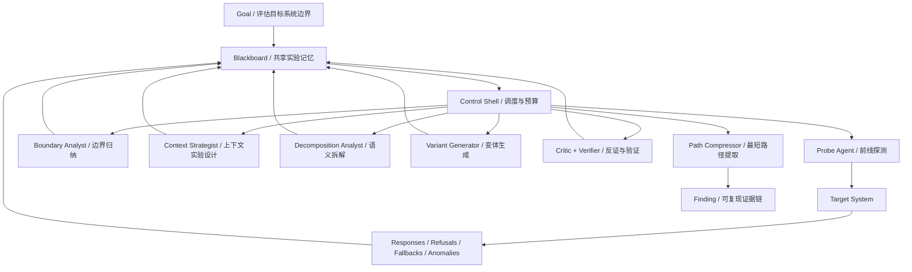
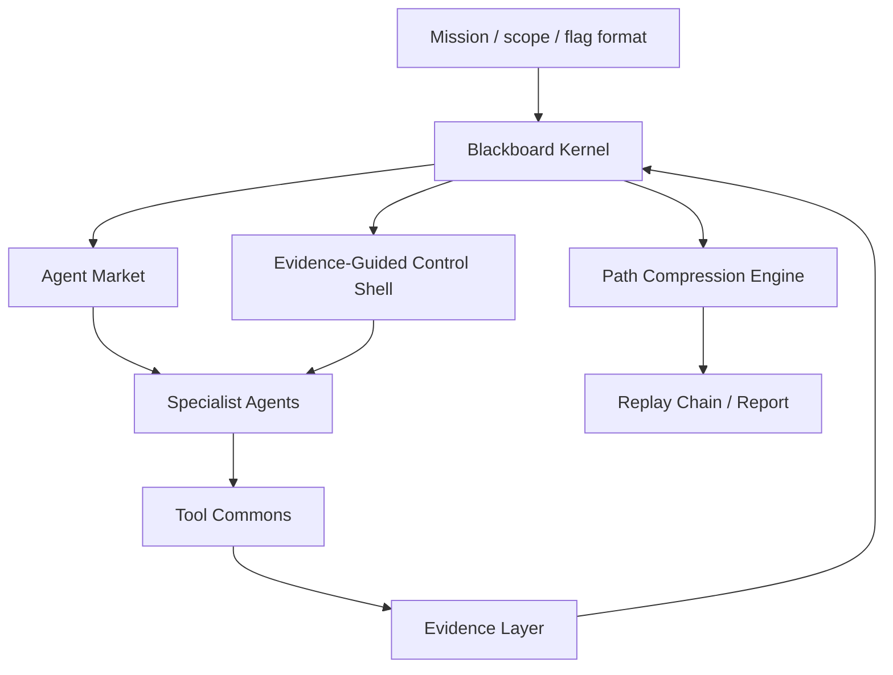

# FlagHunter 红队黑板智能体架构学习笔记 V1

- 日期：2026-06-17
- 主题：从高级红队分析师的智能体系统，反推 FlagHunter 的顶层架构
- 定位：架构学习与方向文档，不是当前实现说明，不是越狱操作手册
- 适用项目：`D:\webstudy\FlagHunter`

---

## 0. 边界声明

本文讨论的是**授权红队 / CTF / 安全评估场景下的智能体架构**。

外部文章中涉及模型安全绕过、上下文操控、分类器规避等内容。FlagHunter 应学习的是其中的系统工程方法，而不是复现绕过技巧：

- 如何把目标看成复杂系统；
- 如何通过实验观察边界；
- 如何让多个 agent 围绕共享状态协同；
- 如何把失败反馈变成下一轮假设；
- 如何从大量探索中压缩出最短可复现路径。

本文不会沉淀可直接用于绕过真实系统安全策略的提示词、payload 或复现步骤。

---

## 1. 资料来源与可信度口径

本轮讨论参考了三类资料：

1. 用户提供的文章摘要：
   - 重点不是“某模型是否被越狱”，而是其中描述的多智能体红队实验室形态。
2. GitHub 上的公开仓库文件：
   - `https://github.com/elder-plinius/CL4R1T4S/blob/main/ANTHROPIC/CLAUDE-FABLE-5.md`
   - 该页面可见一个名为 `CLAUDE-FABLE-5.md` 的大文件，但仓库存在不等于内容真实性已被独立证明。
3. Anthropic 公开资料：
   - `https://www.anthropic.com/news/claude-fable-5-mythos-5`
   - `https://platform.claude.com/docs/en/about-claude/models/introducing-claude-fable-5-and-claude-mythos-5`
   - 官方资料确认了 Fable 5 / Mythos 5、1M context、safeguard / fallback、classifier 等公开叙事，但不证明第三方泄露文件的真实性。

因此本文采用保守判断：

> 不把外部文章当成事实审计报告；只把它当成一个“高级红队智能体系统”的架构案例来学习。

---

## 2. 我们真正能学到什么

外部文章表面讲的是模型越狱，深层讲的是一种高级红队工程思维。

普通使用者会问：

```text
我该写什么 prompt？
```

高级红队工程师会问：

```text
这个系统由哪些层组成？
哪些层负责分类、转交、拒绝、降级？
哪些输入能改变系统状态？
哪些输出能暴露边界？
哪些失败信号能反过来训练下一次实验？
如何自动化这个试错循环？
如何把局部观察拼成系统性结论？
```

这正是 FlagHunter 应学习的能力：不是追求单次“神奇攻击”，而是构建一个能持续逼近目标的红队认知系统。

---

## 3. 高级红队分析师如何思考任务

高级红队工程师看一个任务，不会先问“用什么工具”，而会先建立系统模型。

### 3.1 目标定义

每次任务必须先明确：

```text
我要证明什么？
我要拿 flag？
我要证明某条攻击链存在？
我要找到最短可复现路径？
我要确认某个防护边界是否有效？
```

没有目标定义，agent 会陷入无意义发散。

### 3.2 系统分层

目标系统应被看成多层结构：

```text
入口层
身份层
路由层
过滤层
业务层
存储层
外部服务层
日志 / 审计层
安全策略层
```

模型安全系统里可能是 classifier、policy、fallback、context window、tool gate。

Web / CTF 系统里可能是 WAF、session、路由、模板、数据库、文件系统、admin bot。

### 3.3 边界测绘

红队的核心不是一次成功，而是测出边界：

```text
哪些输入被允许？
哪些输入被拒绝？
拒绝来自哪一层？
响应风格是否变化？
是否出现 fallback / redirect / 403 / 500 / timing 差异？
上下文是否改变系统判断？
```

失败不是垃圾。失败是边界数据。

### 3.4 假设管理

高级分析师会同时维护多个假设：

```text
H1: 登录表单可能存在 SQLi。
H2: /visit + /admin 可能是 bot-XSS。
H3: JWT 可能存在弱签名或 none alg。
H4: 上传点可能能触发解析差异。
H5: source leak 可能泄露 secret。
```

每个假设都必须带：

```text
支持证据
反驳证据
置信度
最小实验
预期输出
失败后能排除什么
```

### 3.5 最小实验

好实验不等于最强 payload。好实验应该回答一个明确问题：

```text
这个参数是否进入 SQL？
这个字段是否被模板渲染？
这个 bot 是否访问用户提交 URL？
这个 cookie 是否控制身份？
这个路径是否能读本地文件？
```

每次工具调用都应该减少不确定性。

### 3.6 反馈学习

高级红队系统不是静态工作流，而是闭环：

```text
实验 -> 观察 -> 归纳边界 -> 更新假设 -> 生成新实验 -> 再验证
```

这也是多智能体系统的价值所在：不同 agent 不是轮流说话，而是围绕同一块共享认知空间持续修正状态。

### 3.7 路径压缩

探索过程可以很乱，但最终成果必须短：

```text
入口 -> 关键事实 -> 利用点 -> 权限/秘密 -> flag
```

真正的 writeup 不应该包含所有弯路，而应该给出最短可复现路径。

---

## 4. 外部案例中的智能体系统抽象

外部文章描述的“群狼战术”，可以抽象为一个小型红队实验室。



### 4.1 Probe Agent

前线探测员不追求一次成功，而是制造可分析观测：

```text
输入是否被接受？
响应是否变化？
是否触发安全层？
是否触发 fallback？
是否出现异常边界？
```

在 FlagHunter 中，对应：

```text
轻量 curl
浏览器探测
表单提交
endpoint discovery
cookie 行为观察
服务 banner / header / DOM 差异收集
```

### 4.2 Boundary Analyst

边界分析师读取探测结果，归纳系统边界：

```text
输入过滤边界
权限边界
session 边界
业务规则边界
文件访问边界
安全策略边界
```

它的输出不是 payload，而是“这个系统如何拒绝、允许、降级、转交”。

### 4.3 Context Strategist

上下文策略师把 context 当成状态，而不是背景。

在长上下文系统中，历史内容会影响后续判断；在 FlagHunter 中，类似对象包括：

```text
SessionContext
blackboardSnapshot
checkpoint
resume_context
ledger
strategy_memory
conversation memory
```

这些对象会影响 agent 下一步决策，所以必须被明确建模。

### 4.4 Decomposition Analyst

拆解分析师关注攻击链的零件化：

```text
一个复杂目标可以拆成多个低风险、可验证、局部独立的问题。
多个局部事实组合后，形成完整路径。
```

在安全任务中，这就是 kill chain：

```text
信息泄露 -> 低权限入口 -> 身份伪造 -> 内网访问 -> secret -> flag
```

FlagHunter 应学习的是“链式组合”思想，而不是把危险过程拆成绕过策略。

### 4.5 Variant Generator

变体生成器不应随机发散，而应根据反馈生成下一批最有信息量的实验：

```text
变体必须绑定 hypothesis。
变体必须回答一个问题。
变体必须有成本与风险估计。
变体失败也应能减少搜索空间。
```

### 4.6 Backend Advisor / Strategist

后端顾问不直接面对目标，而是读取黑板，提出战略建议：

```text
当前最大未知是什么？
哪条假设最值得验证？
哪个 agent 最适合？
下一步实验能否缩短路径？
是否该停止发散进入收敛？
```

在 FlagHunter 中，这个角色可以由 `HypothesisEngine + StrategyMemory + PathFinder + Critic` 逐步组合出来。

### 4.7 Critic / Verifier

批判者和验证者防止多 agent 自嗨：

```text
这个发现能复现吗？
是否有证据引用？
是否只是一次偶然响应？
是否越过授权边界？
是否真的缩短路径？
是否应标记为 dead-end？
```

FlagHunter 已有 `CTFVerifier`，但未来应进一步把验证结果写入黑板证据等级。

### 4.8 Path Compressor

路径压缩器是高手系统的标志。

普通系统输出：

```text
我尝试了很多事情。
```

高级系统输出：

```text
最短可复现路径是这 5 步。
```

FlagHunter 的最终产物应是：

```text
minimal verified replay path
```

而不是原始探索日志。

---

## 5. FlagHunter 要解决的核心问题

FlagHunter 不应只定位为“会调用很多工具的 CTF agent”。

更准确的目标是：

> 构建一个红队黑板智能体系统，让多个专业 agent 围绕目标持续形成假设、调度工具、验证证据、压缩路径，最终给出最短可复现攻击链。

### 5.1 要解决的问题 1：共享认知空间

多 agent 协作的中心不是聊天，而是黑板。

FlagHunter 需要一个结构化黑板，记录：

```text
目标
事实
观测
artifact
攻击面
假设
实验
工具调用
结果
证据
冲突
死路
能力需求
候选路径
候选 flag
验证 flag
replay step
```

### 5.2 要解决的问题 2：探索不是乱跑

每个 agent 使用工具前，都应知道：

```text
我在验证哪个假设？
这个实验预期得到什么？
失败会排除什么？
成本是多少？
风险是多少？
是否重复？
```

### 5.3 要解决的问题 3：失败必须变成知识

当前很多 agent 系统的问题是：失败只是一段日志。

FlagHunter 应把失败变成：

```text
refuting evidence
dead-end
boundary fact
negative capability signal
next-best-action constraint
```

### 5.4 要解决的问题 4：多 agent 不是多嘴

多 agent 的价值不是“大家轮流发言”，而是：

```text
不同专家读取同一黑板投影；
围绕同一目标提出不同假设；
根据证据竞争优先级；
由控制器选择最有价值行动；
最后由 verifier 和 pathfinder 收敛。
```

### 5.5 要解决的问题 5：最终输出是最短路径

FlagHunter 的终局不是“探索了多少”，而是：

```text
从初始目标到 verified flag 的最短可复现路径是什么？
路径上每一步有什么证据？
哪些失败路径被排除？
能否 replay？
```

---

## 6. 建议的顶层架构：Red-Team Blackboard Swarm

建议把未来 FlagHunter 的宏观架构命名为：

> Red-Team Blackboard Swarm

它由四个核心部件组成。



### 6.1 Blackboard Kernel

黑板内核负责保存结构化认知状态。

它不是聊天记录，也不是简单 notes，而是一个可计算的状态图：

```text
Fact --supports--> Hypothesis
Result --refutes--> Hypothesis
Experiment --produces--> Result
Artifact --derived_from--> Observation
Hypothesis --requires--> CapabilityNeed
PathNode --enables--> PathNode
```

### 6.2 Agent Market

agent 不直接抢执行权，而是对黑板上的任务投标：

```text
我能处理哪个 hypothesis？
我需要什么工具？
预计成本多少？
成功会推进哪条路径？
失败会排除什么？
风险多大？
```

控制器选择最高价值 bid。

### 6.3 Evidence-Guided Control Shell

控制器不是普通 planner，而是注意力分配器。

它应根据以下因素选择下一步：

```text
expected_progress
confidence_gain
path_shortening_bonus
novelty
evidence_quality
cost
risk
duplicate_penalty
uncertainty
```

一个简化评分：

```text
priority =
  expected_progress
  * confidence_gain
  * path_shortening_bonus
  * novelty
  / (cost + risk + duplicate_penalty + uncertainty)
```

### 6.4 Evidence Layer

证据层负责把工具输出转成可验证对象：

```text
candidate
observed
runtime
reproducible
verified
rejected
```

没有 evidence reference 的结论不能进入高优先级路径。

### 6.5 Path Compression Engine

路径压缩器持续维护：

```text
当前最短候选路径
当前最短 verified 路径
路径上的证据缺口
可 replay 步骤
已排除死路
```

最终输出：

```text
入口 -> 关键事实 -> 最小实验 -> 利用点 -> flag
```

---

## 7. Agent 角色建议

FlagHunter 后续可以逐步形成下面这些 agent / knowledge source。它们不一定都要是独立进程，早期可以是同一进程里的策略模块。

### 7.1 ScoutAgent

职责：

```text
发现入口
抓取页面
识别服务
收集 artifact
建立初始 attack surface
```

### 7.2 SurfaceMapperAgent

职责：

```text
解析 HTML / JS / forms / links / headers / cookies
把原始观测转成结构化攻击面
```

### 7.3 HypothesisAgent

职责：

```text
根据 facts 生成假设
绑定支持证据
给出最小实验
给出失败后的排除意义
```

### 7.4 SpecialistAgents

按领域划分：

```text
WebAgent
XSSAgent
SQLiAgent
JWTAgent
LFI/SSTIAgent
UploadAgent
CryptoAgent
ReverseAgent
MiscAgent
```

职责是处理自己领域内的 hypothesis，不负责全局规划。

### 7.5 ToolsmithAgent

职责：

```text
写一次性解析脚本
写 payload generator
写 artifact extractor
补足工具链缺口
```

### 7.6 CriticAgent

职责：

```text
找幻觉
找弱证据
找重复探索
找越权风险
标记 dead-end
```

### 7.7 VerifierAgent

职责：

```text
验证 flag
验证可复现
提升或降低证据等级
给出 replay gate
```

### 7.8 PathFinderAgent

职责：

```text
维护从 target 到 flag 的路径图
找当前最短候选路径
找最短 verified replay path
指出路径上缺什么证据
```

### 7.9 NarratorAgent

职责：

```text
把最终路径写成 report / replay / handoff
不参与探索决策
```

---

## 8. 黑板对象模型草案

下面是未来黑板可以逐步沉淀的对象类型。

```text
Mission
Target
Scope
Fact
Observation
Artifact
AttackSurface
Hypothesis
Experiment
ToolCall
Result
Evidence
Contradiction
DeadEnd
CapabilityNeed
PathNode
PathEdge
CandidateFlag
VerifiedFlag
ReplayStep
```

每条记录至少应有：

```text
id
type
created_by
created_at
confidence
status
evidence_refs
artifact_refs
run_id
checkpoint_id
links
```

重要原则：

```text
事实不可静默覆盖，只能追加修正。
假设必须绑定证据。
实验必须绑定 hypothesis。
工具调用必须进入 ledger。
flag 必须经过 verifier。
最终路径必须可 replay。
```

---

## 9. 核心运行循环

推荐的宏观循环：

```text
1. Seed
   写入目标、scope、flag 格式、初始 artifact。

2. Sense
   Scout / Mapper 观察环境，写入 facts / artifacts / surface。

3. Hypothesize
   HypothesisAgent 生成候选攻击假设。

4. Bid
   Specialist agents 对 hypothesis / experiment 投标。

5. Select
   Control Shell 根据收益、成本、风险、路径缩短选择行动。

6. Act
   agent 使用工具执行最小实验，所有 tool call 进入 ledger。

7. Verify
   Verifier 识别 flag、确认可复现性、更新证据等级。

8. Critique
   Critic 标记弱证据、重复路径、幻觉、越权风险、死路。

9. Update
   黑板更新 facts / hypotheses / results / path graph。

10. Compress
   PathFinder 更新当前最短候选路径。

11. Stop / Continue / Retry / Replay
   如果 verified flag 或路径稳定，停止；否则继续发散或重试。
```

---

## 10. 发散与收敛

FlagHunter 必须同时支持发散和收敛。

### 10.1 发散阶段

目标：

```text
发现更多入口
建立更多假设
收集更多 artifact
测绘更多边界
允许低置信度候选
```

典型输出：

```text
new facts
new hypotheses
new attack surfaces
new capability needs
```

### 10.2 收敛阶段

目标：

```text
合并重复假设
验证关键路径
排除死路
提升证据等级
压缩攻击链
```

典型输出：

```text
verified path
replay steps
dead-end list
minimal exploit chain
```

### 10.3 控制器的切换判断

当满足下面条件时，应从发散转向收敛：

```text
已有高置信度 hypothesis
已有候选 flag
已有可疑权限提升路径
已有明显 path shortening signal
预算接近上限
重复探索增多
```

当满足下面条件时，应重新发散：

```text
当前路径被 verifier 拒绝
关键事实被 refute
所有候选路径都 blocked
新 artifact 出现
新的入口面被发现
```

---

## 11. FlagHunter 现有组件映射

当前代码中已经有一些雏形。未来不应推翻，而应重排职责。

```text
interface/blackboard_lite.py
  当前 Web / MCP / resume 控制投影。
  可演进为 entry-facing Blackboard Projection。

knowledge/blackboard.py
  当前 planner 低噪声读视图。
  可演进为 agent-facing Blackboard View。

SessionLedger
  探索历史与工具调用事实。
  可成为 Evidence Layer 的底座之一。

CheckpointStore
  恢复点与 replay / retry 基础。

ArtifactRegistry
  artifact 与 evidence reference 基础。

HypothesisEngine
  假设生成器雏形。

StrategyRegistry
  专家策略注册表雏形。

CTFVerifier
  证据等级与 flag 验证器雏形。

CTFCoordinator
  当前主控。
  可演进为 Control Shell 的一部分。

CTFTaskDispatcher
  当前策略执行大容器。
  后续应逐步瘦身，迁出 specialist chain。

AgentSession + EventBus
  新入口关节。
  后续应承载统一 run lifecycle 与事件分发。
```

---

## 12. 我们会遇到什么问题

### 12.1 黑板污染

如果所有 agent 都能随便写自然语言，黑板会迅速变成噪声池。

对策：

```text
结构化对象
evidence_refs 必填
confidence 分级
verifier 升降级
低置信度内容进入 candidate 区
```

### 12.2 Agent 自嗨

多 agent 容易互相强化错误结论。

对策：

```text
CriticAgent 独立审查
VerifierAgent 只认证据
假设必须可反驳
结论必须能 replay
```

### 12.3 发散失控

如果只奖励“发现新东西”，系统会无限探索。

对策：

```text
预算
重复惩罚
path_shortening_bonus
dead-end 记忆
收敛触发器
```

### 12.4 过早收敛

如果太早押注一条路径，容易错过真正入口。

对策：

```text
保留 frontier view
并行维护多个 hypothesis
定期触发 critic
失败后自动回到发散
```

### 12.5 上下文污染

长上下文会让 agent 混淆事实、假设、历史失败和当前目标。

对策：

```text
角色视图裁剪
事实 / 假设 / 实验 / 结果分层
checkpoint 版本化
旧上下文摘要必须保留 evidence refs
```

### 12.6 工具调用变成目的

安全 agent 很容易为了用工具而用工具。

对策：

```text
每次 tool call 必须绑定 experiment
experiment 必须绑定 hypothesis
hypothesis 必须绑定 evidence
```

### 12.7 最短路径提取困难

探索图会很复杂，最终路径不自然出现。

对策：

```text
每个 result 写入 produces/enables/refutes 边
PathFinder 持续维护候选路径
replay step 与 evidence refs 分离
```

### 12.8 安全边界与授权

自动化红队系统必须严格尊重 scope。

对策：

```text
scope gate
risk scoring
高风险动作人工确认
audit ledger
越界动作直接 blocked
```

---

## 13. 阶段路线建议

### 13.1 第一阶段：黑板对象最小化

先不要做完整图数据库。先固定最小对象：

```text
Fact
Hypothesis
Experiment
Result
Evidence
DeadEnd
PathNode
ReplayStep
```

验收标准：

```text
每个控制决策能追溯到 facts / hypotheses。
每个工具调用能追溯到 experiment。
每个 experiment 能解释成功或失败的意义。
```

### 13.2 第二阶段：Agent 投标机制

先不做复杂多进程 agent。可以从策略模块投标开始：

```text
strategy.propose(context) -> Bid
Bid = {hypothesis_id, expected_progress, cost, risk, required_tools}
```

验收标准：

```text
控制器不再只按固定 chain 顺序跑。
它能解释为什么选这个策略。
```

### 13.3 第三阶段：Verifier / Critic 分离

把“执行成功”和“证据成立”分开。

验收标准：

```text
candidate result 不会直接变成 verified finding。
flag / exploit path 必须经过 verifier。
失败路径能被写成 dead-end。
```

### 13.4 第四阶段：PathFinder

从 ledger / blackboard 中抽取路径图。

验收标准：

```text
系统能输出当前最短候选路径。
系统能说明路径上缺哪条证据。
系统能从成功 run 中生成 minimal replay chain。
```

### 13.5 第五阶段：真正多 agent

等对象、调度、证据、路径都稳定后，再引入更复杂的 agent 并行。

验收标准：

```text
agent 之间不私聊。
所有协作通过黑板。
每个 agent 只读自己的投影视图。
写入必须结构化。
```

---

## 14. 对当前开发的约束建议

近期不要把 FlagHunter 继续做成“更大的 dispatcher”。

更好的工程约束：

```text
新增能力必须写入黑板对象。
新增策略必须声明 hypothesis / experiment / expected signal。
新增工具调用必须能进入 ledger。
新增成功路径必须能被 verifier 和 pathfinder 消费。
入口层不要绕过 AgentSession / EventBus。
控制链继续保护 controlDecision -> ingressHandoff -> coordinator -> ledger/checkpoint -> blackboardSnapshot -> continue/retry/replay。
```

对于多 agent：

```text
不要先追求 agent 数量。
先追求黑板质量、证据质量、调度质量、路径质量。
```

---

## 15. 最终浓缩

外部案例里的高级红队系统，本质是：

```text
多 agent
自动反馈
边界建模
上下文状态建模
假设迭代
证据验证
路径压缩
```

FlagHunter 喜欢的黑板架构，本质是：

```text
共享认知空间
专家知识源
控制器调度
证据等级
最短路径提取
```

两者合起来，就是 FlagHunter 最值得走的顶层框架：

> Red-Team Blackboard Swarm

目标不是让 agent 多说话，也不是让工具更多，而是让系统像高级红队分析师一样：

```text
观察系统；
建立假设；
设计最小实验；
利用反馈修正认知；
组合局部事实形成攻击链；
验证证据；
最后输出最短、可复现、证据充分的通向目标路径。
```

