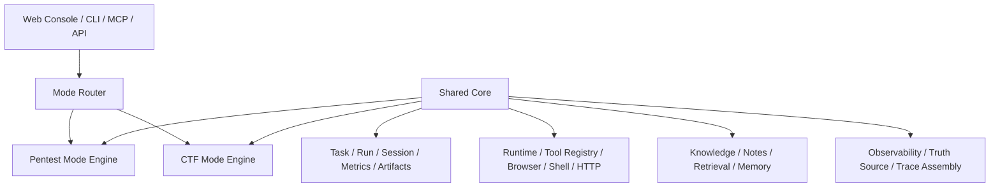

# FlagHunter Mode Boundaries and Mode Router Design

**Date:** 2026-05-29  
**Last Synced:** 2026-05-29  
**Project:** `D:\webstudy\FlagHunter`  
**Scope:** Shared Core / Pentest Mode / CTF Mode boundary design, `Mode Router` minimal contract, and first-batch RED test design

---

## 1. Problem Statement

FlagHunter is no longer a single-purpose task runner. It is already evolving toward two materially different operating modes:

- **Pentest Mode** — evidence-oriented, scope-aware, operator-facing security work
- **CTF Mode** — flag-oriented, challenge-aware, fast iteration and exploit solving

The project already shares a large amount of infrastructure:

- task / run / session / metrics / trace storage
- runtime / tools / browser / shell / HTTP execution
- notes / knowledge / retrieval
- Web Console / CLI / MCP / API access paths

The current risk is not a lack of capability. The risk is that mode-specific behavior is still too implicit and too easy to spread across shared files through local `if/else` growth.

That causes four structural problems:

1. the system can no longer clearly answer whether a change belongs to the shared backend chain or to a mode-specific engine
2. task creation, retry, replay, and continue can drift in behavior because mode is not formalized as a stable contract
3. UI and observability layers are forced to infer operator intent from incidental fields like `ctfType` or route-specific assumptions
4. future evaluation work cannot cleanly separate “Pentest correctness” from “CTF solving correctness”

This design turns “mode” into a first-class backend concept without forcing a large rewrite.

---

## 2. Design Goal

This design has three direct goals:

1. **keep one shared core** for execution, persistence, truth-source assembly, and operator surfaces
2. **make Pentest Mode and CTF Mode explicit** instead of letting them emerge from scattered hints
3. **introduce a minimal Mode Router** that resolves stable mode facts at ingress and for derived tasks

This is intentionally a boundary design, not a full engine rewrite.

---

## 3. Recommended Architecture

The recommended structure is:

- **Shared Core**
- **Pentest Mode Engine**
- **CTF Mode Engine**
- **Mode Router**

This is preferred over:

- one large agent with mode branches everywhere
- two totally separate backends

### 3.1 Why not a single large agent with scattered branching

That approach is superficially cheap but structurally expensive:

- it keeps shared layers and mode behavior coupled
- it makes testing harder because intent is hidden in implementation detail
- it increases the chance that retries, replays, or UI surfaces reinterpret mode differently

### 3.2 Why not split into two independent systems

That approach is too heavy for the project’s current stage:

- duplicated task surfaces
- duplicated traces and truth-source logic
- duplicated runtime and tool management
- duplicated API and Web Console maintenance

### 3.3 Recommended shape



---

## 4. Boundary Definition

### 4.1 Shared Core responsibilities

Shared Core is responsible for all mode-agnostic capabilities that represent facts, execution plumbing, and operator-facing surfaces.

#### Shared Core includes

1. **Task and run fact layer**
   - task registry
   - run / session identifiers
   - metrics
   - traces
   - attachments
   - truth-source assembly
   - API payload shaping

2. **Runtime and tool layer**
   - runtime selection
   - tool registry
   - tool execution
   - browser / shell / HTTP / file primitives

3. **Knowledge and notes layer**
   - notes persistence
   - retrieval
   - reusable knowledge storage

4. **Ingress and presentation layer**
   - Web Console
   - CLI
   - MCP
   - API

#### Shared Core must not decide

Shared Core should not decide:

- whether a task should think like Pentest or CTF
- which CTF strategy to use
- whether Pentest should recon first or exploit first
- what success means for a mode beyond reading the mode contract

### 4.2 Pentest Mode responsibilities

Pentest Mode should own Pentest-specific business behavior, including:

- target-oriented recon / enum / exploit planning
- scope-aware decision flow
- evidence-oriented completion logic
- safer operator-facing progression
- findings / proof / reporting-oriented output shaping

Pentest Mode should not own shared persistence or truth-source assembly.

### 4.3 CTF Mode responsibilities

CTF Mode should own CTF-specific solving behavior, including:

- challenge fingerprinting
- hypothesis generation
- strategy selection and fallback
- verifier / flag handling
- aggressive exploit iteration
- solve-path compression

`D:\webstudy\FlagHunter\pentestagent\agents\pa_agent\ctf_dispatcher.py` is already evidence that CTF logic is not just a generic task variation; it is effectively a dedicated engine path that needs explicit architectural status.

---

## 5. Mode Router Design Goal

`Mode Router` is the minimal ingress component that makes mode explicit.

It does **not** execute tasks. It resolves mode facts and produces a stable contract for downstream consumers.

### 5.1 Router responsibilities

`Mode Router` is responsible for:

1. accepting raw task requests
2. reading explicit mode input first
3. inheriting mode facts for derived tasks
4. applying only a very small amount of safe defaulting
5. producing a normalized mode contract

### 5.2 Router does not do

`Mode Router` does not:

- run the agent loop
- call tools
- build runtime instances
- shape task detail or traces payloads
- choose CTF internal strategies
- choose Pentest internal tactics

### 5.3 Recommended placement

Recommended module path:

- `D:\webstudy\FlagHunter\pentestagent\interface\mode_router.py`

This is acceptable as the minimal landing zone because:

- it is shareable by Web / CLI / MCP
- it avoids hard-coding the concept inside `web_server.py`
- it avoids incorrectly treating mode routing as a CTF-only concept

---

## 6. Mode Router Input Contract

The minimal raw input shape should support the following fields:

```json
{
  "title": "...",
  "target": "...",
  "goal": "...",
  "mode": "ctf | pentest | auto | omitted",
  "ctfType": "web | pwn | crypto | misc | reverse | omitted",
  "docker": false,
  "maxIter": 30,
  "flagFormat": "flag\\{[^}]+\\}"
}
```

### 6.1 `mode`

`mode` is the most important field.

Allowed intended semantics:

- `mode = "ctf"` → explicit CTF Mode
- `mode = "pentest"` → explicit Pentest Mode
- `mode = "auto"` → router may infer from limited structured signals
- omitted → resolve using default ingress rules, but always normalize into an explicit stored mode

### 6.2 `ctfType`

`ctfType` is a subtype hint, not a replacement for mode.

Examples:

- `web`
- `crypto`
- `pwn`
- `reverse`
- `misc`

Important rule:

> `ctfType` must not be treated as a global substitute for `mode`.

A web CTF challenge and a web pentest target are not the same task class.

---

## 7. Minimal Resolved Mode Contract

For the first cut, the contract should be intentionally small and stable.

### 7.1 Minimal first-phase contract

```json
{
  "mode": "ctf | pentest",
  "modeSubtype": "web | crypto | pwn | reverse | misc | network | host | api | unknown",
  "goalStyle": "flag | evidence"
}
```

This design deliberately keeps the first stored contract to three fields because they are the most reusable and least ambiguous.

### 7.2 Why these three fields first

They are enough to support:

- task persistence
- replay / retry / continue inheritance
- UI mode badges
- downstream engine routing
- future evaluation segmentation

Without overcommitting the first phase to a larger policy object.

### 7.3 Future-expanded contract direction

A richer future contract may add fields like:

```json
{
  "mode": "ctf",
  "engine": "ctf",
  "subtype": "web",
  "goalStyle": "flag",
  "finishPolicy": "flag_or_exhausted",
  "scopePolicy": "challenge_sandbox",
  "knowledgeProfile": "ctf",
  "labels": {
    "modeBadge": "CTF",
    "subtypeBadge": "WEB"
  }
}
```

Equivalent Pentest examples may resolve to `goalStyle = "evidence"` and a Pentest-specific scope / finish profile.

That richer model is intentionally deferred. Phase 1 only requires the minimal stable facts.

---

## 8. Mode Resolution Rules

Mode resolution should remain simple and deterministic.

### Rule 1: explicit `mode` wins

If a request explicitly says:

- `mode=ctf`
- `mode=pentest`

that value must win.

This prevents target text, goal text, or incidental fields from overriding operator intent.

### Rule 2: derived tasks inherit from the source task

The following flows must inherit mode facts from the source task instead of re-guessing:

- `retry`
- `replay`
- `continue`

This prevents a CTF task from replaying or retrying as Pentest, or vice versa.

### Rule 3: inference is allowed only for `mode=auto` or omitted mode

Only in those cases may the router apply limited inference.

Minimal inference rule for phase 1:

- if `ctfType` exists, prefer `ctf`
- otherwise default to `pentest`

No natural-language goal guessing should be introduced in phase 1.

### Rule 4: ingress defaults should remain explicit after normalization

Recommended default behavior:

- general API / Web / CLI ingress → normalize to `pentest` when not otherwise specified
- CTF-specific ingress → normalize to `ctf`

Even when mode is defaulted, stored tasks must carry explicit resolved fields.

---

## 9. Persistence Impact

The task model should persist at least these fields:

```json
{
  "mode": "ctf",
  "modeSubtype": "web",
  "goalStyle": "flag"
}
```

### 9.1 Why persistence is required

These fields are needed later by:

- task detail
- traces
- retry / replay / continue
- detail source explanation
- knowledge retrieval policy
- UI badges
- future eval grouping

If the router result exists only transiently in memory, the system will still be forced to re-infer mode in downstream layers.

---

## 10. Minimal Integration Points

The first integration pass should touch only four entry points:

1. `POST /api/tasks`
2. `replay_trace`
3. `retry_task`
4. `continue_task`

### 10.1 `POST /api/tasks`

The ingress payload should go through `Mode Router`, and the resolved fields should be written back to the task record.

### 10.2 `replay_trace`

Replay should inherit the source task mode contract instead of re-resolving from scratch.

### 10.3 `retry_task`

Retry should inherit the source task mode contract instead of re-resolving from scratch.

### 10.4 `continue_task`

Continue should use the already stored task mode and should not recalculate mode.

### 10.5 Explicitly out of scope for this first cut

This design does not require immediate changes to:

- full Web Console redesign for mode-specific views
- traces page structure
- knowledge engine internals
- CTF dispatcher internals
- Pentest engine internal planning model

---

## 11. Frontend Impact

Frontend impact should remain intentionally small in the first pass.

### 11.1 Required short-term support

- task payloads include `mode`
- task payloads include `modeSubtype` when available
- list / detail UI may show a small mode badge such as `CTF` or `PENTEST`

### 11.2 Not required yet

- two fully separate UIs
- mode-specific layout forks
- complex mode-aware operator flows in the frontend

The first job is to make the data truthful and explicit.

---

## 12. First-Batch RED Test Design

The first RED batch should test only the mode-routing contract, not full task execution.

Recommended new test file:

- `D:\webstudy\FlagHunter\tests\unit\interface\test_mode_router.py`

### 12.1 RED scope

The first RED batch should pin four essential concerns:

1. explicit mode wins
2. `mode=auto + ctfType` resolves to CTF
3. missing mode defaults remain stable
4. replay / retry / continue inherit mode

### 12.2 Minimal failing tests

#### RED 1 — explicit `mode=ctf` wins

Input example:

```json
{
  "mode": "ctf",
  "ctfType": "web",
  "target": "http://example.test",
  "goal": "analyze the challenge"
}
```

Expected contract:

- `mode == "ctf"`
- `modeSubtype == "web"`
- `goalStyle == "flag"`

#### RED 2 — explicit `mode=pentest` wins even when `ctfType` exists

Input example:

```json
{
  "mode": "pentest",
  "ctfType": "web",
  "target": "http://example.test",
  "goal": "find security issues"
}
```

Expected contract:

- `mode == "pentest"`
- `goalStyle == "evidence"`

For the first batch, Pentest subtype inference does not need to be forced beyond a stable non-CTF result.

#### RED 3 — `mode=auto + ctfType=web` maps to CTF

Input example:

```json
{
  "mode": "auto",
  "ctfType": "web",
  "target": "http://challenge.test"
}
```

Expected contract:

- `mode == "ctf"`
- `modeSubtype == "web"`
- `goalStyle == "flag"`

#### RED 4 — no `mode` and no `ctfType` defaults to Pentest

Input example:

```json
{
  "target": "http://corp.test",
  "goal": "enumerate and verify vulnerabilities"
}
```

Expected contract:

- `mode == "pentest"`
- `goalStyle == "evidence"`

#### RED 5 — retry inherits source mode

Source task example:

```json
{
  "id": "task_1",
  "mode": "ctf",
  "modeSubtype": "web",
  "goalStyle": "flag"
}
```

Expected derived contract:

- `mode == "ctf"`
- `modeSubtype == "web"`
- `goalStyle == "flag"`

#### RED 6 — replay / continue inherit source mode

Replay and continue should preserve source task mode facts instead of re-inferring them.

Expected derived contract:

- `mode == "ctf"`
- `modeSubtype == "web"`
- `goalStyle == "flag"`

### 12.3 Explicitly deferred tests

The following tests are useful later but intentionally not part of the first RED batch:

- invalid `mode` handling policy
- NLP-based goal guessing
- Pentest subtype inference depth
- API / task detail persistence round-trip assertions
- frontend mode badge rendering tests

---

## 13. Minimal Migration Sequence

### Step 1

Add the `Mode Router` module itself as a pure resolver.

### Step 2

Route `POST /api/tasks` through it and persist `mode / modeSubtype / goalStyle`.

### Step 3

Make `retry / replay / continue` inherit the resolved mode contract.

### Step 4

Expose mode badges in the frontend.

### Step 5

Use the stable boundary to continue separating Pentest and CTF engine behavior.

---

## 14. Expected Value of This Design

This design gives the project three immediate benefits:

1. **layer clarity**
   - it becomes much easier to tell whether a change belongs to Shared Core or to a mode engine

2. **stable derived task behavior**
   - retry / replay / continue no longer drift by reinterpreting task type indirectly

3. **cleaner future evaluation**
   - Pentest and CTF can later be evaluated separately while still using the same shared shell

---

## 15. Decision Summary

### Adopt

- one shared core
- one explicit Pentest Mode path
- one explicit CTF Mode path
- one thin `Mode Router` as the ingress contract resolver
- first-phase persistence of `mode`, `modeSubtype`, and `goalStyle`

### Reject

- a single large agent with hidden mode branches spread across the codebase
- two fully separate backend systems
- goal-text or target-text NLP guessing in phase 1

### First implementation target

The most justified first implementation target is the `Mode Router` boundary itself, followed by integration into task ingress and derived task actions.

---

## 16. Spec Self-Review

Self-review result for this spec:

- no placeholder sections remain
- the minimal contract is intentionally narrower than the future-expanded contract and does not conflict with it
- the scope stays at boundary design and first-batch RED planning, rather than drifting into engine rewrites
- the document avoids ambiguous mode inference rules by explicitly preferring deterministic structured input

This spec is ready for implementation planning or incremental execution.
