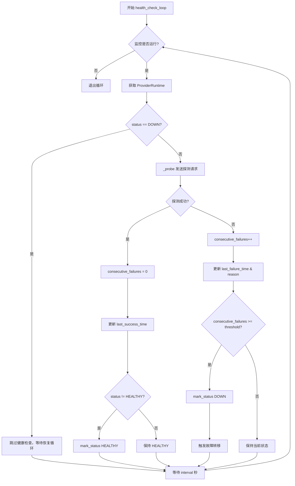
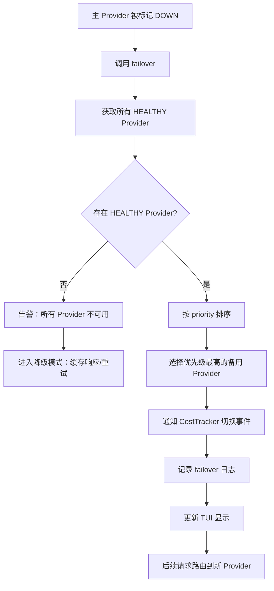
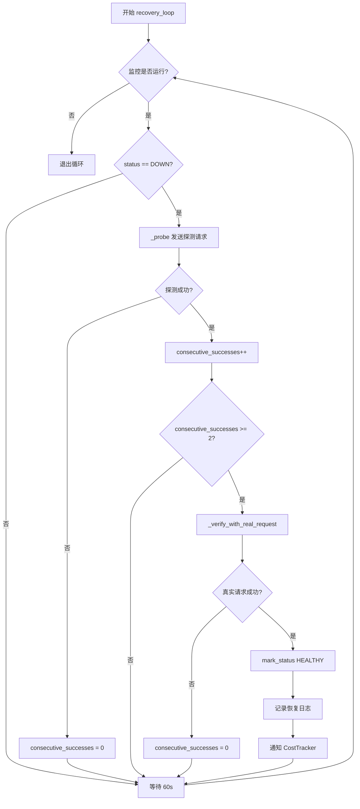
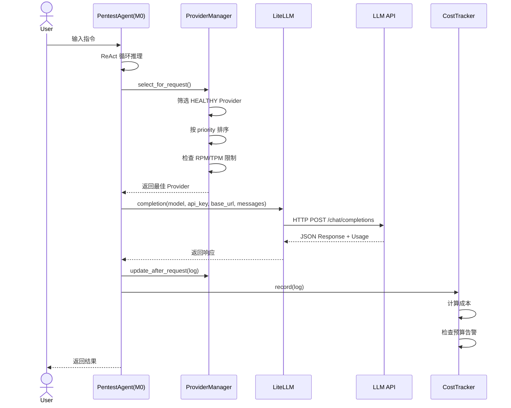
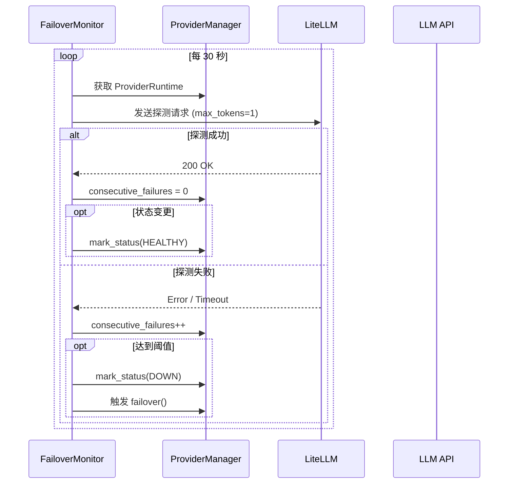
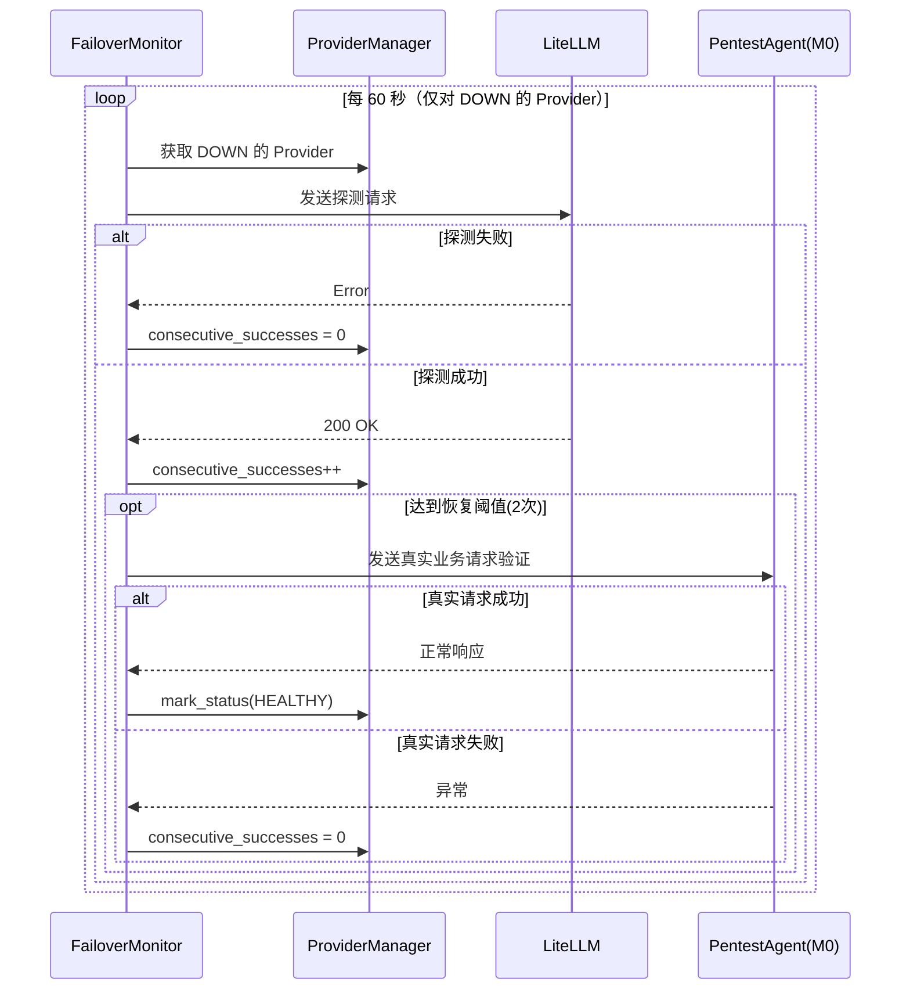
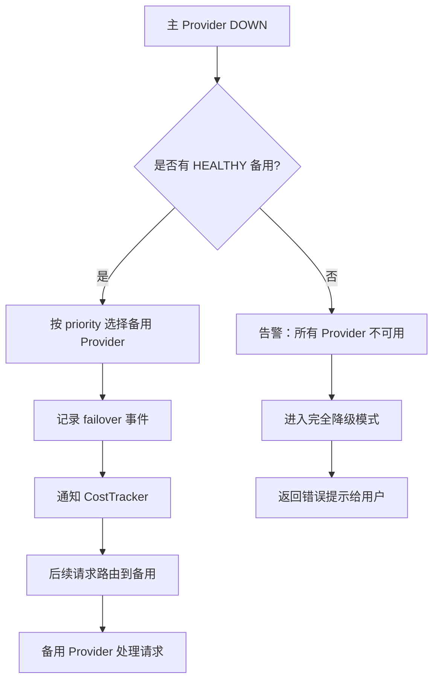
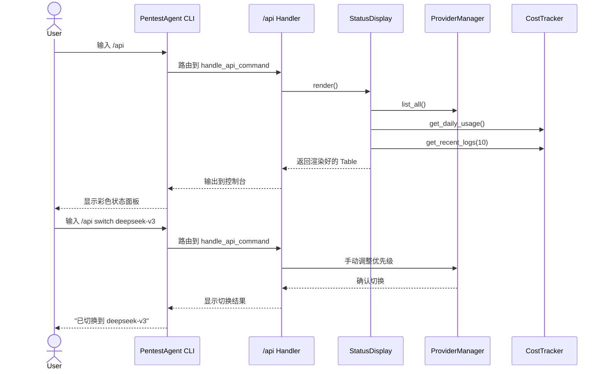

# RFC-01: M1 API接入调度模块设计

> **版本**: v1.0  
> **作者**: CPA Team  
> **日期**: 2025-01-15  
> **状态**: 设计阶段  
> **模块**: `cpa_modules/m1_api_hub/`  

---

## 1. 概述

### 1.1 设计目标

M1（API Hub）模块是 CyberPenAgent（CPA）项目对开源项目 PentestAgent 进行模块化扩展的第一个功能模块。其核心设计目标如下：

| 目标编号 | 目标描述 | 优先级 |
|---------|---------|--------|
| G1 | 支持任意数量的 LLM Provider 同时注册与管理 | P0 |
| G2 | 兼容中转站、官方 API、DeepSeek 等任意 OpenAI-compatible 端点 | P0 |
| G3 | 实现自动健康检查（每 30 秒 ping 检测） | P0 |
| G4 | 实现断线检测（连续 3 次失败标记为 down） | P0 |
| G5 | 实现自动恢复检测（down 后每 60 秒探测，连续 2 次成功 → 真实请求验证 → 恢复） | P0 |
| G6 | 实现自动故障转移（主渠道 down → 自动切换备用渠道） | P0 |
| G7 | 实现 Token 消耗追踪（精确到每次请求，支持 input/output 分别统计） | P1 |
| G8 | 实现预算告警（超过 80% 每日预算触发告警） | P1 |
| G9 | 实现 TUI 状态展示（`/api` 命令显示彩色状态面板） | P1 |
| G10 | 对原版 PentestAgent 侵入 < 25 行代码 | P0 |

### 1.2 适用范围

本文档适用于：
- `cpa_modules/m1_api_hub/` 目录下的全部源码文件
- 对原版 PentestAgent 的侵入修改点（M0 层）
- 与 M1 模块交互的其他 CPA 模块（如 M2 记忆模块、M3 工具模块等）

### 1.3 术语定义

| 术语 | 英文 | 定义 |
|-----|------|------|
| Provider | Provider | 一个 LLM API 接入渠道，包含 endpoint、key、model 等配置 |
| 主渠道 | Primary Provider | 优先级最高的可用 Provider，默认承担所有请求 |
| 备用渠道 | Fallback Provider | 当主渠道不可用时，按优先级顺序接替的 Provider |
| 健康检查 | Health Check | 通过发送轻量级探测请求检测 Provider 可用性的机制 |
| 故障转移 | Failover | 当当前 Provider 不可用时，自动切换到备用 Provider 的过程 |
| TUI | Terminal UI | 基于文本的终端用户界面，使用 Rich 库渲染 |
| M0 | Module 0 | 原版 PentestAgent 核心代码，视为第 0 模块 |

---

## 2. 架构设计

### 2.1 M1 在整体系统中的位置

```
+------------------+      +------------------+      +------------------+
|   User Input     |      |   /api Command   |      |   .env Config    |
+--------+---------+      +--------+---------+      +--------+---------+
         |                         |                         |
         v                         v                         v
+-------------------------------------------------------------+
|                    CPA Module Layer (M1-MN)                  |
|  +-------------------+  +-------------------+  +-----------+ |
|  | M1: API Hub       |  | M2: Memory        |  | M3: Tools | |
|  | (调度/故障转移)    |  | (上下文管理)       |  | (工具集)  | |
|  +--------+----------+  +-------------------+  +-----------+ |
|           ^                                                  |
+-----------|--------------------------------------------------+
            |
+-----------v--------------------------------------------------+
|                    M0: PentestAgent Core                     |
|  +-------------------+  +-------------------+  +-----------+ |
|  | LiteLLM Wrapper   |  | ReAct Loop        |  | Scanner   | |
|  | (completion calls)|  | (推理循环)         |  | (扫描器)  | |
|  +-------------------+  +-------------------+  +-----------+ |
+-------------------------------------------------------------+
                              |
                              v
+-------------------------------------------------------------+
|                    LLM Provider Layer                        |
|  +--------+  +--------+  +--------+  +--------+  +--------+ |
|  | OpenAI |  |DeepSeek|  | 中转A  |  | 中转B  |  | ...    | |
|  +--------+  +--------+  +--------+  +--------+  +--------+ |
+-------------------------------------------------------------+
```

### 2.2 M1 内部组件架构

```
cpa_modules/m1_api_hub/
|
+-- __init__.py              # 模块入口，暴露公共API
+-- config_schema.py         # 配置模型与.env解析 [无运行时依赖]
+-- models.py                # 核心数据模型(Pydantic) [依赖: config_schema]
+-- provider_manager.py      # Provider注册与选择 [依赖: models, config_schema]
+-- failover_monitor.py      # 健康检查与故障转移 [依赖: models, provider_manager]
+-- cost_tracker.py          # Token追踪与预算 [依赖: models]
+-- status_display.py        # TUI状态面板 [依赖: models, provider_manager, cost_tracker]
+-- commands.py              # /api命令路由注册 [依赖: status_display]
```

**文件依赖关系图：**

```
                    +------------------+
                    | config_schema.py |
                    +--------+---------+
                             |
           +-----------------+-----------------+
           |                 |                 |
           v                 v                 v
    +------------+    +------------+    +------------+
    |  models.py |    | commands.py|    |provider_mgr|
    +------+-----+    +------+-----+    +------+-----+
           |                 |                 |
           |                 |    +------------v------+
           |                 |    |failover_monitor.py|
           |                 |    +--------+----------+
           |                 |             |
           |                 |    +--------v----------+
           |                 |    | cost_tracker.py   |
           |                 |    +--------+----------+
           |                 |             |
           |                 |    +--------v----------+
           |                 +--->| status_display.py |
           |                      +--------+----------+
           |                               |
           +-------------------------------+
                             |
                    +--------v---------+
                    |    __init__.py   |  <-- 对外暴露
                    +------------------+
```

### 2.3 M1 与 M0 的交互关系

```
+------------------+          +------------------+
|   M0 (PentestAgent)|         |   M1 (API Hub)   |
|                  |          |                  |
|  pentest_agent.py|          |  __init__.py     |
|  +-------------+ |          |  +-------------+ |
|  |main()       | |<-------->|  |init_m1()    | |
|  |  - 添加1行   | |  启动注册 |  |  - 读取配置  | |
|  +-------------+ |          |  +-------------+ |
|                  |          |                  |
|  utils/          |          |  provider_mgr    |
|  +-------------+ |          |  +-------------+ |
|  |llm_utils.py | |<-------->|  |get_provider | |
|  |              | |  获取实例 |  +-------------+ |
|  |  修改completion|         |                  |
|  |  _call() 3行 | |          |  failover_mon    |
|  +-------------+ |          |  +-------------+ |
|                  |<-------->|  |health_check  | |
|  cli/            |  状态回调  |  +-------------+ |
|  +-------------+ |          |                  |
|  |commands.py  | |<-------->|  commands.py     |
|  |              | |  注册/api |  +-------------+ |
|  |  添加1行注册 | |          |  |/api handler | |
|  +-------------+ |          |  +-------------+ |
+------------------+          +------------------+
```

---

## 3. 数据模型

### 3.1 ProviderConfig — Provider 配置模型

```python
class ProviderConfig(BaseModel):
    """单个 Provider 的配置，从环境变量解析"""

    name: str               # 唯一标识名，如 "openai-primary"
    display_name: str       # 显示名，如 "OpenAI GPT-4"
    api_key: str            # API Key
    base_url: HttpUrl       # API Base URL
    model: str              # 模型名，如 "gpt-4o"
    priority: int = 0       # 优先级，数值越小越优先（0=主渠道）
    timeout: float = 30.0   # 请求超时秒数
    rpm_limit: int = 0      # 每分钟请求限制，0=不限制
    tpm_limit: int = 0      # 每分钟 Token 限制，0=不限制
    tags: list[str] = []    # 标签，如 ["official", "paid"]
    enabled: bool = True    # 是否启用

    # 健康检查配置
    health_check_interval: int = 30       # 健康检查间隔(秒)
    health_check_fail_threshold: int = 3  # 连续失败阈值
    recovery_interval: int = 60           # 恢复检测间隔(秒)
    recovery_success_threshold: int = 2   # 连续成功恢复阈值
```

### 3.2 ProviderStatus — Provider 运行时状态

```python
class ProviderStatus(str, Enum):
    """Provider 运行状态枚举"""
    HEALTHY = "healthy"       # 健康可用
    DEGRADED = "degraded"     # 性能降级（响应慢但仍可用）
    DOWN = "down"             # 不可用
    UNKNOWN = "unknown"       # 状态未知（刚注册未检测）

class ProviderRuntime(BaseModel):
    """Provider 运行时状态对象，由 ProviderManager 维护"""

    config: ProviderConfig           # 关联的配置
    status: ProviderStatus = ProviderStatus.UNKNOWN
    consecutive_failures: int = 0    # 连续失败次数
    consecutive_successes: int = 0   # 连续成功次数
    last_check_time: datetime | None = None
    last_success_time: datetime | None = None
    last_failure_time: datetime | None = None
    last_failure_reason: str = ""    # 最后一次失败原因
    total_requests: int = 0          # 总请求数
    total_failures: int = 0          # 总失败数
    avg_latency_ms: float = 0.0      # 平均延迟(ms)
    current_rpm: int = 0             # 当前 RPM
    current_tpm: int = 0             # 当前 TPM
```

### 3.3 RequestLog — 单次请求日志

```python
class RequestLog(BaseModel):
    """单次 LLM 请求的完整记录"""

    id: str = Field(default_factory=lambda: str(uuid4()))
    provider_name: str           # 使用的 Provider
    model: str                   # 实际调用的模型
    timestamp: datetime = Field(default_factory=datetime.utcnow)
    status: Literal["success", "failure"]
    latency_ms: float            # 请求耗时(ms)

    # Token 消耗
    input_tokens: int = 0
    output_tokens: int = 0
    total_tokens: int = 0

    # 成本（USD）
    input_cost: float = 0.0
    output_cost: float = 0.0
    total_cost: float = 0.0

    # 错误信息（失败时）
    error_type: str | None = None
    error_message: str | None = None

    # 请求元数据
    metadata: dict = {}          # 扩展字段
```

### 3.4 BudgetConfig — 预算配置

```python
class BudgetConfig(BaseModel):
    """每日预算配置"""

    daily_budget_usd: float = 0.0        # 每日预算上限，0=不限制
    alert_threshold_percent: float = 80.0 # 告警阈值(%)
    alert_cooldown_minutes: int = 60      # 告警冷却时间(分钟)

class DailyBudgetState(BaseModel):
    """每日预算运行时状态"""

    date: date                           # 当前日期
    consumed_usd: float = 0.0            # 已消耗金额
    consumed_tokens: int = 0             # 已消耗 Token 总数
    alert_triggered: bool = False        # 今日是否已触发告警
    last_alert_time: datetime | None = None
```

### 3.5 模型关系图

```
+---------------+        1:N        +---------------+
| BudgetConfig  |<----------------->|DailyBudgetState|
+---------------+                   +---------------+

+---------------+        1:N        +---------------+
|ProviderManager|*----------------->|ProviderRuntime|
+---------------+  (按priority排序)  +---------------+
                                           |
                                           | 1:1
                                           v
                                    +---------------+
                                    |ProviderConfig |
                                    +---------------+

+---------------+        1:N        +---------------+
| CostTracker   |*----------------->|  RequestLog   |
+---------------+   (按时间窗口)     +---------------+
```

---

## 4. 组件详细设计

### 4.1 `config_schema.py` — 配置 Schema 定义

**职责**: 定义所有环境变量配置的数据结构，提供从 `.env` 到 Python 对象的解析能力。

**核心类**:
- `M1Config` — M1 模块的顶级配置容器
- `ProviderConfig` — 单个 Provider 配置（见 3.1 节）
- `BudgetConfig` — 预算配置（见 3.4 节）

**环境变量命名规范**:

```
# 模块总开关
CPA_M1_API_HUB=true

# Provider 配置（支持无限数量，按数字后缀区分）
CPA_M1_P0_NAME=openai-primary
CPA_M1_P0_API_KEY=sk-xxxxxxxx
CPA_M1_P0_BASE_URL=https://api.openai.com/v1
CPA_M1_P0_MODEL=gpt-4o
CPA_M1_P0_PRIORITY=0
CPA_M1_P0_TIMEOUT=30
CPA_M1_P0_RPM_LIMIT=0
CPA_M1_P0_TPM_LIMIT=0
CPA_M1_P0_TAGS=official,paid
CPA_M1_P0_ENABLED=true

# 预算配置
CPA_M1_BUDGET_DAILY_USD=10.0
CPA_M1_BUDGET_ALERT_PERCENT=80
CPA_M1_BUDGET_ALERT_COOLDOWN=60
```

**关键函数**:

```python
def load_m1_config_from_env() -> M1Config:
    """从环境变量解析 M1 完整配置

    自动扫描 CPA_M1_P{N}_ 前缀的环境变量，N 从 0 开始递增，
    直到找不到连续的编号为止。

    Returns:
        M1Config: 解析后的完整配置对象

    Raises:
        ValueError: 当必填字段缺失或格式错误时
    """
```

### 4.2 `provider_manager.py` — Provider 注册与选择

**职责**: 维护所有 Provider 的运行时状态，提供查询、选择、排序能力。是 M1 的核心调度器。

**核心类** `ProviderManager`:

```python
class ProviderManager:
    """Provider 管理器 — 单例模式"""

    def __init__(self, config: M1Config):
        self._providers: dict[str, ProviderRuntime] = {}
        self._ordered: list[str] = []  # 按 priority 排序的 name 列表
        self._lock = asyncio.Lock()
        self._budget_config = config.budget

    # ---- 生命周期 ----

    async def register(self, cfg: ProviderConfig) -> None:
        """注册一个 Provider。如果 name 已存在则覆盖。"""

    async def unregister(self, name: str) -> None:
        """注销一个 Provider。"""

    async def initialize_all(self) -> None:
        """批量注册配置中的所有 Provider。"""

    # ---- 查询 ----

    def get(self, name: str) -> ProviderRuntime | None:
        """按名称获取 Provider 运行时状态。"""

    def list_all(self) -> list[ProviderRuntime]:
        """获取所有 Provider（按优先级排序）。"""

    def list_healthy(self) -> list[ProviderRuntime]:
        """获取状态为 HEALTHY 的 Provider 列表。"""

    def get_primary(self) -> ProviderRuntime | None:
        """获取当前主 Provider（优先级最高且健康）。

        返回 None 表示没有可用的 Provider。
        """

    # ---- 选择 ----

    async def select_for_request(self) -> ProviderRuntime:
        """为下一次请求选择最佳 Provider。

        选择逻辑：
        1. 获取所有 HEALTHY 状态的 Provider
        2. 按 priority 升序排列
        3. 检查 RPM/TPM 限制，排除超限的 Provider
        4. 返回优先级最高的可用 Provider

        Raises:
            NoProviderAvailable: 没有任何可用 Provider 时
        """

    def update_after_request(self, name: str, log: RequestLog) -> None:
        """请求完成后更新 Provider 统计信息。"""

    def mark_status(self, name: str, status: ProviderStatus, reason: str = "") -> None:
        """标记 Provider 状态变更。"""
```

**状态转换规则**:

```
UNKNOWN --(首次健康检查成功)--> HEALTHY
UNKNOWN --(首次健康检查失败)--> 计数器+1，保持 UNKNOWN

HEALTHY --(请求失败)--> consecutive_failures++
       --(consecutive_failures >= 阈值)--> DOWN
       --(请求成功)--> consecutive_failures = 0

DOWN --(恢复检测失败)--> 保持 DOWN，consecutive_successes = 0
    --(恢复检测成功)--> consecutive_successes++
    --(consecutive_successes >= 阈值)--> 发送真实请求验证
    --(真实请求成功)--> HEALTHY
    --(真实请求失败)--> DOWN，consecutive_successes = 0
```

### 4.3 `failover_monitor.py` — 健康检查与故障转移

**职责**: 在后台运行定时任务，执行健康检查、故障检测、自动恢复。是 M1 的可靠性保障核心。

**核心类** `FailoverMonitor`:

```python
class FailoverMonitor:
    """故障转移监控器 — 单例模式"""

    def __init__(self, provider_manager: ProviderManager):
        self._pm = provider_manager
        self._tasks: dict[str, asyncio.Task] = {}
        self._running = False

    async def start(self) -> None:
        """启动所有 Provider 的监控任务。"""

    async def stop(self) -> None:
        """停止所有监控任务。"""

    async def _health_check_loop(self, name: str) -> None:
        """单个 Provider 的健康检查循环。"""

    async def _recovery_loop(self, name: str) -> None:
        """单个 Provider 的恢复检测循环。"""

    async def _probe(self, runtime: ProviderRuntime) -> bool:
        """发送探测请求，返回是否成功。

        探测请求使用 LiteLLM 发送一个极简的 completion：
        - messages: [{"role": "user", "content": "hi"}]
        - max_tokens: 1
        - 超时: min(timeout, 10s)
        """

    async def _verify_with_real_request(self, runtime: ProviderRuntime) -> bool:
        """使用真实请求验证 Provider 已恢复。

        调用 PentestAgent 实际使用的 prompt 模板发送一次完整请求，
        验证其能正常处理业务请求。
        """
```

**健康检查算法流程图**:



**故障转移算法流程图**:



**恢复检测算法流程图**:



### 4.4 `cost_tracker.py` — Token 追踪与预算管理

**职责**: 精确记录每次请求的 Token 消耗和成本，管理每日预算，触发预算告警。

**核心类** `CostTracker`:

```python
class CostTracker:
    """成本追踪器 — 单例模式"""

    def __init__(self, budget_config: BudgetConfig):
        self._config = budget_config
        self._logs: deque[RequestLog] = deque(maxlen=10000)
        self._daily_state = DailyBudgetState(date=date.today())
        self._callbacks: list[Callable] = []  # 告警回调

    # ---- 记录 ----

    def record(self, log: RequestLog) -> None:
        """记录一次请求的消耗。

        1. 追加到日志队列
        2. 更新每日预算状态
        3. 检查是否触发告警
        """

    def on_budget_alert(self, callback: Callable[[float, float], None]) -> None:
        """注册预算告警回调函数。

        Args:
            callback: 接收 (consumed_usd, budget_usd) 的回调
        """

    # ---- 查询 ----

    def get_daily_usage(self) -> tuple[float, float]:
        """获取今日消耗 (used_usd, budget_usd)。"""

    def get_provider_usage(self, provider_name: str) -> dict:
        """获取指定 Provider 的统计信息。"""

    def get_recent_logs(self, n: int = 100) -> list[RequestLog]:
        """获取最近 N 条请求日志。"""

    # ---- 内部 ----

    def _check_budget_alert(self) -> None:
        """检查是否达到告警阈值。"""

    def _rollover_date(self) -> None:
        """跨日时重置每日状态。"""
```

**成本计算逻辑**:

```python
# 使用 LiteLLM 的 cost_calculator 模块获取模型单价
from litellm import cost_calculator

def calculate_cost(log: RequestLog) -> RequestLog:
    """计算请求成本，回填到 log 对象。"""
    try:
        # 尝试使用 LiteLLM 内置价格表
        model_info = litellm.get_model_info(log.model)
        input_cost_per_token = model_info.get("input_cost_per_token", 0)
        output_cost_per_token = model_info.get("output_cost_per_token", 0)
    except Exception:
        # 回退到手动价格表
        input_cost_per_token, output_cost_per_token = FALLBACK_PRICES.get(
            log.model, (0.0, 0.0)
        )

    log.input_cost = log.input_tokens * input_cost_per_token
    log.output_cost = log.output_tokens * output_cost_per_token
    log.total_cost = log.input_cost + log.output_cost
    return log
```

### 4.5 `status_display.py` — TUI 状态面板

**职责**: 使用 `rich` 库渲染 `/api` 命令的彩色状态面板。

**核心类** `StatusDisplay`:

```python
class StatusDisplay:
    """TUI 状态展示器"""

    def __init__(self, pm: ProviderManager, ct: CostTracker):
        self._pm = pm
        self._ct = ct
        self._console = Console()

    def render(self) -> RenderResult:
        """渲染完整状态面板，返回 rich Table 对象。"""

    def _render_provider_table(self) -> Table:
        """渲染 Provider 状态表格。"""

    def _render_budget_panel(self) -> Panel:
        """渲染预算使用面板。"""

    def _render_stats_panel(self) -> Panel:
        """渲染统计信息面板。"""

    def print_to_console(self) -> None:
        """输出到控制台。"""
```

**TUI 布局设计**:

```
+----------------------------------------------------------+
| [bold cyan]CyberPenAgent M1 - API Hub 状态面板[/]              |
| 更新时间: 2025-01-15 14:32:01                            |
+----------------------------------------------------------+
|                                                          |
| [bold]Provider 状态[/]                                      |
| +----------+--------+-------+------+------+-----------+  |
| | 名称      | 状态   | 优先级 | 延迟 | RPM  | 总请求    |  |
| +----------+--------+-------+------+------+-----------+  |
| | openai-p | [green]HEALTHY[/] |   0   | 320ms| 12   | 1,234     |  |
| | deepseek | [green]HEALTHY[/] |   1   | 450ms|  8   |   567     |  |
| | proxy-a  | [red]DOWN[/]    |   2   |  --  |  0   |    89     |  |
| +----------+--------+-------+------+------+-----------+  |
|                                                          |
| [bold]今日预算[/]    $8.42 / $10.00  [yellow]▓▓▓▓▓▓▓▓░░ 84%[/] ⚠️  |
| [bold]总请求数[/]    1,890                                       |
| [bold]成功率[/]      95.2%                                     |
|                                                          |
| [bold]最近请求[/]                                                 |
| 14:31:52  openai-p  gpt-4o   1,240/580  $0.0042  ✓      |
| 14:31:45  deepseek  ds-v3    2,100/890  $0.0018  ✓      |
| 14:31:38  openai-p  gpt-4o      890/320  $0.0029  ✓      |
+----------------------------------------------------------+
```

**状态颜色编码**:

| 状态 | 颜色 | Rich Style |
|------|------|------------|
| HEALTHY | 绿色 | `[green]● HEALTHY[/]` |
| DEGRADED | 黄色 | `[yellow]● DEGRADED[/]` |
| DOWN | 红色 | `[red]● DOWN[/]` |
| UNKNOWN | 灰色 | `[dim]● UNKNOWN[/]` |

### 4.6 `commands.py` — 命令路由注册

**职责**: 将 `/api` 命令注册到 PentestAgent 的命令系统中。

```python
from pentest_agent.cli.commands import register_command

async def handle_api_command(args: str, context: dict) -> str:
    """处理 /api 命令。

    子命令:
        /api         — 显示状态面板
        /api status  — 同上
        /api list    — 列出所有 Provider
        /api switch <name> — 手动切换到指定 Provider
        /api logs [n] — 显示最近 n 条日志（默认 20）
        /api budget  — 显示预算详情
    """
    display = StatusDisplay(get_pm(), get_ct())
    subcmd = args.strip().split()[0] if args.strip() else "status"

    match subcmd:
        case "status" | "":
            display.print_to_console()
            return ""
        case "list":
            return format_provider_list()
        case "switch":
            return await handle_manual_switch(args)
        case "logs":
            return format_recent_logs(args)
        case "budget":
            return format_budget_detail()
        case _:
            return f"[red]未知子命令: {subcmd}[/]"

def init_commands() -> None:
    """在 PentestAgent 启动时调用，注册 /api 命令。"""
    register_command("api", handle_api_command, 
                     help_text="M1 API Hub 状态管理 (/api status/list/switch/logs/budget)")
```

### 4.7 `__init__.py` — 模块入口

```python
"""M1 API Hub 模块 — CyberPenAgent 的 LLM Provider 调度中心。"""

from .config_schema import M1Config, ProviderConfig, BudgetConfig
from .models import ProviderRuntime, ProviderStatus, RequestLog, DailyBudgetState
from .provider_manager import ProviderManager
from .failover_monitor import FailoverMonitor
from .cost_tracker import CostTracker
from .status_display import StatusDisplay
from .commands import init_commands, handle_api_command

# 模块级单例（延迟初始化）
_pm: ProviderManager | None = None
_fm: FailoverMonitor | None = None
_ct: CostTracker | None = None
_sd: StatusDisplay | None = None

async def init_m1() -> None:
    """初始化 M1 模块。

    1. 从环境变量加载配置
    2. 初始化 ProviderManager 并注册所有 Provider
    3. 初始化 CostTracker
    4. 初始化 FailoverMonitor 并启动健康检查
    5. 注册 /api 命令

    仅在 CPA_M1_API_HUB=true 时执行。
    """
    global _pm, _fm, _ct, _sd

    if os.getenv("CPA_M1_API_HUB", "").lower() != "true":
        logger.info("[M1] 模块已禁用，跳过初始化")
        return

    config = load_m1_config_from_env()

    _pm = ProviderManager(config)
    await _pm.initialize_all()

    _ct = CostTracker(config.budget)

    _fm = FailoverMonitor(_pm)
    await _fm.start()

    _sd = StatusDisplay(_pm, _ct)
    init_commands()

    logger.info(f"[M1] 已初始化，注册了 {len(config.providers)} 个 Provider")

async def shutdown_m1() -> None:
    """优雅关闭 M1 模块。"""
    if _fm:
        await _fm.stop()
    logger.info("[M1] 已关闭")

# ---- 对外暴露的便捷函数 ----

def get_provider_manager() -> ProviderManager:
    """获取 ProviderManager 单例。"""
    if _pm is None:
        raise RuntimeError("M1 模块尚未初始化")
    return _pm

def get_cost_tracker() -> CostTracker:
    """获取 CostTracker 单例。"""
    if _ct is None:
        raise RuntimeError("M1 模块尚未初始化")
    return _ct
```

---

## 5. 接口契约

### 5.1 M1 对外暴露的公共 API

| 函数/类 | 签名 | 返回值 | 异常 | 说明 |
|---------|------|--------|------|------|
| `init_m1` | `async () -> None` | `None` | `ValueError` | 模块初始化入口 |
| `shutdown_m1` | `async () -> None` | `None` | — | 优雅关闭 |
| `get_provider_manager` | `() -> ProviderManager` | `ProviderManager` | `RuntimeError` | 获取 PM 单例 |
| `get_cost_tracker` | `() -> CostTracker` | `CostTracker` | `RuntimeError` | 获取 CT 单例 |
| `ProviderManager.select_for_request` | `async () -> ProviderRuntime` | `ProviderRuntime` | `NoProviderAvailable` | 选择最佳 Provider |
| `ProviderManager.mark_status` | `(name, status, reason) -> None` | `None` | `KeyError` | 标记状态变更 |
| `CostTracker.record` | `(log: RequestLog) -> None` | `None` | — | 记录请求消耗 |
| `CostTracker.on_budget_alert` | `(callback) -> None` | `None` | — | 注册告警回调 |
| `StatusDisplay.render` | `() -> RenderResult` | `Table/Panel` | — | 渲染状态面板 |
| `handle_api_command` | `async (args, context) -> str` | `str` | — | /api 命令处理器 |

### 5.2 M1 对 M0 的侵入点清单

**目标**: 对原版 PentestAgent 侵入 **< 25 行代码**，共 4 处修改。

#### 侵入点 #1 — `pentest_agent.py:main()`（+4 行）

```python
# === CPA M1 注入开始 ===
if os.getenv("CPA_M1_API_HUB", "").lower() == "true":
    from pentestagent.cpa_modules.m1_api_hub import init_m1
    asyncio.run(init_m1())
# === CPA M1 注入结束 ===
```

#### 侵入点 #2 — `utils/llm_utils.py:completion_call()` 修改（+10 行）

```python
def completion_call(messages, model=None, **kwargs):
    # === CPA M1 注入开始 ===
    if os.getenv("CPA_M1_API_HUB", "").lower() == "true":
        from pentestagent.cpa_modules.m1_api_hub import get_provider_manager, get_cost_tracker
        from pentestagent.cpa_modules.m1_api_hub.models import RequestLog
        import litellm, time
        pm = get_provider_manager()
        runtime = asyncio.run(pm.select_for_request())
        cfg = runtime.config
        kwargs["api_key"] = cfg.api_key
        kwargs["base_url"] = str(cfg.base_url)
        model = cfg.model
        start = time.time()
        try:
            resp = litellm.completion(model=model, messages=messages, **kwargs)
            latency = (time.time() - start) * 1000
            usage = resp.get("usage", {})
            log = RequestLog(
                provider_name=cfg.name,
                model=model,
                status="success",
                latency_ms=latency,
                input_tokens=usage.get("prompt_tokens", 0),
                output_tokens=usage.get("completion_tokens", 0),
                total_tokens=usage.get("total_tokens", 0),
            )
            pm.update_after_request(cfg.name, log)
            get_cost_tracker().record(log)
            return resp
        except Exception as e:
            latency = (time.time() - start) * 1000
            log = RequestLog(
                provider_name=cfg.name,
                model=model,
                status="failure",
                latency_ms=latency,
                error_type=type(e).__name__,
                error_message=str(e),
            )
            pm.update_after_request(cfg.name, log)
            raise
    # === CPA M1 注入结束 ===

    # 原版代码保持不变...
```

#### 侵入点 #3 — `pentest_agent.py:shutdown()`（+4 行）

```python
# === CPA M1 注入开始 ===
if os.getenv("CPA_M1_API_HUB", "").lower() == "true":
    from pentestagent.cpa_modules.m1_api_hub import shutdown_m1
    asyncio.run(shutdown_m1())
# === CPA M1 注入结束 ===
```

#### 侵入点 #4 — `cli/commands.py:init_commands()`（+3 行）

```python
def init_commands():
    # ... 原版命令注册 ...

    # === CPA M1 注入开始 ===
    if os.getenv("CPA_M1_API_HUB", "").lower() == "true":
        from pentestagent.cpa_modules.m1_api_hub.commands import init_commands as m1_init_cmds
        m1_init_cmds()
    # === CPA M1 注入结束 ===
```

**侵入统计**: 4 个文件，共约 21 行新增代码，满足 < 25 行约束。

---

## 6. 配置 Schema

### 6.1 完整环境变量配置说明

| 变量名 | 类型 | 必填 | 默认值 | 说明 |
|--------|------|------|--------|------|
| `CPA_M1_API_HUB` | bool | 是 | `false` | 模块总开关 |
| `CPA_M1_P{n}_NAME` | str | 是 | — | Provider 唯一标识名 |
| `CPA_M1_P{n}_DISPLAY_NAME` | str | 否 | =NAME | 显示名称 |
| `CPA_M1_P{n}_API_KEY` | str | 是 | — | API Key |
| `CPA_M1_P{n}_BASE_URL` | url | 是 | — | API Base URL |
| `CPA_M1_P{n}_MODEL` | str | 是 | — | 模型标识 |
| `CPA_M1_P{n}_PRIORITY` | int | 否 | 0 | 优先级（0=最高） |
| `CPA_M1_P{n}_TIMEOUT` | float | 否 | 30.0 | 请求超时(秒) |
| `CPA_M1_P{n}_RPM_LIMIT` | int | 否 | 0 | RPM 限制(0=不限) |
| `CPA_M1_P{n}_TPM_LIMIT` | int | 否 | 0 | TPM 限制(0=不限) |
| `CPA_M1_P{n}_TAGS` | str | 否 | — | 逗号分隔的标签 |
| `CPA_M1_P{n}_ENABLED` | bool | 否 | `true` | 是否启用 |
| `CPA_M1_P{n}_HEALTH_CHECK_INTERVAL` | int | 否 | 30 | 健康检查间隔(秒) |
| `CPA_M1_P{n}_FAIL_THRESHOLD` | int | 否 | 3 | 断线判定连续失败次数 |
| `CPA_M1_P{n}_RECOVERY_INTERVAL` | int | 否 | 60 | 恢复检测间隔(秒) |
| `CPA_M1_P{n}_RECOVERY_THRESHOLD` | int | 否 | 2 | 恢复判定连续成功次数 |
| `CPA_M1_BUDGET_DAILY_USD` | float | 否 | 0.0 | 每日预算上限(USD) |
| `CPA_M1_BUDGET_ALERT_PERCENT` | float | 否 | 80.0 | 预算告警阈值(%) |
| `CPA_M1_BUDGET_ALERT_COOLDOWN` | int | 否 | 60 | 告警冷却时间(分钟) |

### 6.2 .env 示例配置（含 5 个 Provider）

```bash
# ============================================================
# CPA M1 API Hub 模块配置
# ============================================================
CPA_M1_API_HUB=true

# ---- Provider 0: OpenAI 官方 (主渠道) ----
CPA_M1_P0_NAME=openai-primary
CPA_M1_P0_DISPLAY_NAME=OpenAI GPT-4o
CPA_M1_P0_API_KEY=sk-proj-xxxxxxxxxxxxxxxxxxxxxxxx
CPA_M1_P0_BASE_URL=https://api.openai.com/v1
CPA_M1_P0_MODEL=gpt-4o
CPA_M1_P0_PRIORITY=0
CPA_M1_P0_TIMEOUT=30
CPA_M1_P0_TAGS=official,high-quality
CPA_M1_P0_ENABLED=true

# ---- Provider 1: DeepSeek (第一备用) ----
CPA_M1_P1_NAME=deepseek-v3
CPA_M1_P1_DISPLAY_NAME=DeepSeek V3
CPA_M1_P1_API_KEY=sk-xxxxxxxxxxxxxxxxxxxxxxxx
CPA_M1_P1_BASE_URL=https://api.deepseek.com/v1
CPA_M1_P1_MODEL=deepseek-chat
CPA_M1_P1_PRIORITY=1
CPA_M1_P1_TIMEOUT=45
CPA_M1_P1_TAGS=china,cheap
CPA_M1_P1_ENABLED=true

# ---- Provider 2: 中转站 A (第二备用) ----
CPA_M1_P2_NAME=proxy-alpha
CPA_M1_P2_DISPLAY_NAME=中转站 Alpha
CPA_M1_P2_API_KEY=sk-alpha-xxxxxxxxxxxxxxxx
CPA_M1_P2_BASE_URL=https://api.alpha-proxy.com/v1
CPA_M1_P2_MODEL=gpt-4o-mini
CPA_M1_P2_PRIORITY=2
CPA_M1_P2_TIMEOUT=60
CPA_M1_P2_TAGS=proxy,cheap
CPA_M1_P2_ENABLED=true

# ---- Provider 3: Azure OpenAI (第三备用) ----
CPA_M1_P3_NAME=azure-gpt4
CPA_M1_P3_DISPLAY_NAME=Azure OpenAI
CPA_M1_P3_API_KEY=xxxxxxxxxxxxxxxxxxxxxxxx
CPA_M1_P3_BASE_URL=https://my-resource.openai.azure.com/openai/deployments/my-deployment/chat/completions?api-version=2024-06-01
CPA_M1_P3_MODEL=azure/gpt-4o
CPA_M1_P3_PRIORITY=3
CPA_M1_P3_TIMEOUT=30
CPA_M1_P3_TAGS=azure,enterprise
CPA_M1_P3_ENABLED=true

# ---- Provider 4: 本地 Ollama (降级渠道) ----
CPA_M1_P4_NAME=ollama-local
CPA_M1_P4_DISPLAY_NAME=本地 Ollama
CPA_M1_P4_API_KEY=ollama
CPA_M1_P4_BASE_URL=http://localhost:11434
CPA_M1_P4_MODEL=ollama/llama3.1:8b
CPA_M1_P4_PRIORITY=99
CPA_M1_P4_TIMEOUT=120
CPA_M1_P4_TAGS=local,free,slow
CPA_M1_P4_ENABLED=true

# ---- 预算配置 ----
CPA_M1_BUDGET_DAILY_USD=10.0
CPA_M1_BUDGET_ALERT_PERCENT=80
CPA_M1_BUDGET_ALERT_COOLDOWN=60
```

---

## 7. 流程设计

### 7.1 正常请求流程



### 7.2 故障检测流程



### 7.3 自动恢复流程



### 7.4 故障转移流程



### 7.5 TUI 交互流程



---

## 8. 错误处理策略

### 8.1 异常场景与处理方式

| 场景 | 异常类型 | 处理方式 | 降级策略 |
|------|----------|----------|----------|
| 所有 Provider 不可用 | `NoProviderAvailable` | 抛出异常，M0 捕获后提示用户 | 使用本地缓存/重试 |
| 请求超时 | `TimeoutError` | 标记当前 Provider 失败，重试备用 | 自动故障转移 |
| API 返回 4xx | `BadRequestError` | 不重试，直接上报错误 | 无（请求本身有问题） |
| API 返回 429 | `RateLimitError` | 等待 5s 后重试同一 Provider | 如仍失败则切换备用 |
| API 返回 5xx | `ServerError` | 标记失败，自动切换备用 | 故障转移 |
| 网络不可达 | `ConnectionError` | 标记 Provider DOWN，启动恢复检测 | 故障转移 |
| Token 预算超限 | `BudgetExceeded` | 告警，但仍允许请求（仅提醒） | 无硬阻断 |
| 配置解析失败 | `ValueError` | 初始化时抛出，阻止模块启动 | 回退到 M0 原版行为 |
| LiteLLM 不识别模型 | `ModelNotFound` | 使用回退价格表计算成本 | 继续运行，成本估算 |

### 8.2 降级策略

```python
class DegradationStrategy:
    """当 M1 完全不可用时（所有 Provider DOWN）的降级策略。"""

    @staticmethod
    async def handle_no_provider(request_params: dict) -> dict:
        """降级处理：当没有可用 Provider 时。

        策略优先级：
        1. 如果配置了本地 Ollama，尝试使用本地模型
        2. 返回缓存的上一次成功响应（带提示）
        3. 抛出明确错误，提示用户检查网络/配置
        """
```

---

## 9. 验收标准

| 编号 | 验收标准 | 验证方法 |
|------|----------|----------|
| AC-01 | 支持至少 10 个 Provider 同时注册且不冲突 | 编写单元测试：循环注册 10 个 Provider，验证每个都能独立查询 |
| AC-02 | 支持中转站、官方 API、DeepSeek、Azure 等任意 OpenAI-compatible 端点 | 集成测试：分别配置上述 4 类端点，验证都能成功发送请求 |
| AC-03 | 健康检查每 30 秒自动执行 | 日志验证：检查 health_check_loop 的日志时间戳间隔是否为 30s ± 2s |
| AC-04 | 连续 3 次失败正确标记 Provider 为 DOWN | 模拟测试：使用 mock server 返回 3 次 500，验证状态变为 DOWN |
| AC-05 | DOWN 的 Provider 每 60 秒自动探测恢复 | 日志验证：DOWN 后检查 recovery_loop 的执行间隔是否为 60s ± 2s |
| AC-06 | 连续 2 次探测成功 + 真实请求验证通过后恢复 HEALTHY | 模拟测试：mock 2 次成功 + 1 次真实成功，验证状态流转 |
| AC-07 | 主 Provider DOWN 后自动切换到备用 Provider | 集成测试：强制主 Provider 失败，验证请求自动路由到备用 |
| AC-08 | Token 消耗精确追踪到每次请求（input/output 分别统计） | 单元测试：模拟请求返回固定 usage，验证 Tracker 记录正确 |
| AC-09 | 超过 80% 每日预算触发告警 | 单元测试：模拟消耗 81% 预算，验证告警回调被触发 |
| AC-10 | `/api` 命令显示彩色状态面板 | 手动测试：输入 `/api` 验证 Rich 表格正确渲染，包含所有 Provider |
| AC-11 | 对原版 PentestAgent 侵入 < 25 行代码 | 代码审查：统计 M0 中 `CPA M1` 标记的代码行数 |
| AC-12 | 模块可通过 `CPA_M1_API_HUB=false` 完全关闭 | 集成测试：设置 false 后验证 M1 不加载，M0 正常运行 |

---

## 10. 风险分析

| 风险编号 | 风险描述 | 影响等级 | 发生概率 | 应对方案 |
|----------|----------|----------|----------|----------|
| R1 | LiteLLM 版本升级导致 API 不兼容 | 高 | 中 | 锁定 LiteLLM 版本范围；升级前运行全量测试 |
| R2 | 健康检查探测请求消耗不必要的 Token | 中 | 高 | 探测请求使用 max_tokens=1；支持用户关闭健康检查 |
| R3 | 故障转移时丢失对话上下文 | 高 | 低 | 故障转移只切换底层 Provider，不重置对话历史 |
| R4 | 多个 Provider 同时 DOWN 导致服务完全不可用 | 高 | 低 | 配置本地 Ollama 作为最终降级渠道 |
| R5 | Token 成本计算不准确（价格表滞后） | 中 | 中 | 使用 LiteLLM 内置价格表 + 手动回退表；定期更新 |
| R6 | 高频请求导致 ProviderManager 成为性能瓶颈 | 中 | 中 | 使用 asyncio.Lock 细粒度锁定；缓存 Provider 排序结果 |
| R7 | 环境变量配置错误导致模块无法启动 | 低 | 高 | 提供配置验证脚本；启动时打印配置摘要供确认 |
| R8 | TUI 渲染在 Windows 终端显示异常 | 低 | 中 | 使用 Rich 库的自动检测功能；提供 `--no-color` 回退 |

---

## 11. 附录

### 11.1 术语表

| 缩写/术语 | 全称 | 说明 |
|-----------|------|------|
| CPA | CyberPenAgent | 本项目二开后的产品名 |
| M0 | Module 0 | 原版 PentestAgent 核心代码 |
| M1 | Module 1 | API Hub 模块，本文档描述的对象 |
| Provider | Provider | LLM API 服务提供方 |
| TUI | Text User Interface | 基于文本的终端用户界面 |
| RPM | Requests Per Minute | 每分钟请求数 |
| TPM | Tokens Per Minute | 每分钟 Token 数 |
| Failover | Failover | 故障转移，自动切换到备用系统 |
| Pydantic | Pydantic | Python 数据验证库，v2 版本 |
| LiteLLM | LiteLLM | 统一调用多种 LLM API 的 Python 库 |

### 11.2 参考文档

1. **PentestAgent 源码**: https://github.com/GH05TCREW/PentestAgent
2. **LiteLLM 文档**: https://docs.litellm.ai/
3. **LiteLLM Provider 配置**: https://docs.litellm.ai/docs/providers
4. **LiteLLM 成本计算**: https://docs.litellm.ai/docs/completion/token_usage
5. **Pydantic v2 文档**: https://docs.pydantic.dev/latest/
6. **Rich 库文档**: https://rich.readthedocs.io/
7. **OpenAI API 兼容规范**: https://platform.openai.com/docs/api-reference

### 11.3 文件清单

```
cpa_modules/m1_api_hub/
├── __init__.py              # 模块入口，单例管理
├── config_schema.py         # 环境变量配置 Schema
├── models.py                # Pydantic 数据模型
├── provider_manager.py      # Provider 注册、查询、选择
├── failover_monitor.py      # 健康检查、故障转移、恢复检测
├── cost_tracker.py          # Token 追踪、预算管理
├── status_display.py        # TUI 状态面板渲染
└── commands.py              # /api 命令路由
```

---

> **文档结束**  
> 如有疑问，请联系 CPA Team
